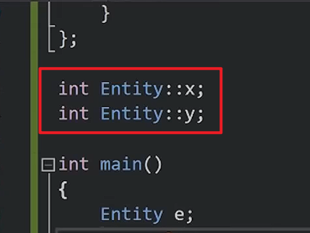

# 结构体和类外

在结构体和类**外**声明的static变量，**只在当前声明的.cpp文件内可见**

- 如果在另一个.cpp文件内声明一个重名的变量，构建link的时候不会报错，因为只在声明的.cpp文件内可见
- 如果把static去掉就会报重定义的错误,此时可以通过extern来引用,避免报错,此时的变量共用一个

# 结构体和类内

在结构体和类**内**声明的static变量，**所有的结构体和类的`实例`共用一个static变量**

- 结构体和类内的static要在结构体和类外单独定义(C++17开始，可以使用inline static在结构体和类内定义)

  


> [!IMPORTANT]
>
> 如果在**头文件**里面使用了static，然后在两个cpp文件里面都引用了头文件，就相当于在这两个cpp文件里面创造了一个static变量
>
> 因为引用头文件的原理就是把头文件里面的代码**复制粘贴**一份过来

# 静态方法

```cpp
#include<iostream>


struct Entity
{
	int x, y;//非静态成员

	static void print()
	{
		std::cout << x << "," << y << std::endl;//报错,此时的方法跟放在“类外”没什么区别，正确的是显示的把对象传过来，跟放在类外一样的写法
	}
};

static void print(Entity e)
{
	std::cout << e.x << "," << e.y << std::endl;
}

int main()
{
	Entity e;
	e.x = 1;
	e.y = 2;
	e.print(e);

	return 0;
}
```

1. **`类内`的 `static void Print()`（静态成员函数）**

- **含义**：声明该方法为**类的静态成员函数**。

- 主要特点：

  1. **没有 `this` 指针**：它属于**类本身**，而不是类的某个具体对象。

  2. **无法**直接访问**非静态成员**：由于没有this指针，它不能直接访问类的普通（非静态）成员变量。

     > **注意图片中的报错**：图中类内 `Print()` 里的 `x` 和 `y` 下方有红色波浪线，就是因为 `x` 和 `y` 是类的非静态成员变量，静态成员函数无法直接访问它们。

  3. **调用方式**：可以通过 `类名::Print()` 直接调用，无需创建类实例对象。

     ```cpp
     struct Entity
     {
     	static void print()
     	{
     		std::cout << "Hello World!" << std::endl;
     	}
     };
     
     int main()
     {
     	Entity::print();
     	return 0;
     }
     ```

     

------

2. **`类外`的 `static void Print()`（静态普通/全局函数）**

- **含义**：声明该函数具有**内部链接（Internal Linkage）**。

- 主要特点：

  1. **作用域限制**：该函数**仅在当前编译单元（当前 `.cpp` 文件）内可见**，其他源文件无法通过 `extern` 或同名函数调用它。

  2. **防止命名冲突**：常用来定义只在当前文件内部使用的辅助函数，避免与其它文件中的同名函数产生链接冲突（LNK2005 重复定义错误）。

  3. **变量访问**：它可以访问当前文件作用域内可见的变量（例如图中通过全局/文件作用域对象 `e` 来访问 `e.x` 和 `e.y`）。

     ```cpp
     static void print(Entity e)//传对象
     {
     	std::cout << e.x << "," << e.y << std::endl;
     }
     
     int main()
     {
     	Entity e;
     	e.x = 1;
     	e.y = 2;
     	e.print(e);
     
     	return 0;
     }
     ```

     ```cpp
     Entity e{ 1,2 };//全局
     
     static void print(Entity e)
     {
     	std::cout << e.x << "," << e.y << std::endl;
     }
     
     int main()
     {
     	print(e);
     
     	return 0;
     }
     ```

     

# 普通函数内的静态变量

```cpp
 void Function()
 {
     static i = 0;
     i++;
     std::cout << i << std::endl;
 }
int main()
{
    Function();
    Function();
    Function();
    Function();
    Function();
    //输出
    //1
    //2
    //3
    //4
    //5
}
```

普通函数内的静态变量每次调用该函数的时候，只会在第一次创建，后面调用则不会创建一个新的变量，会一直共用第一次创建的那一个变量

> 静态方法也同理
