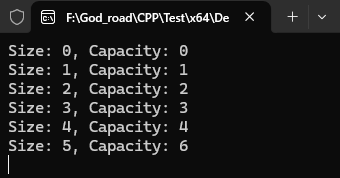
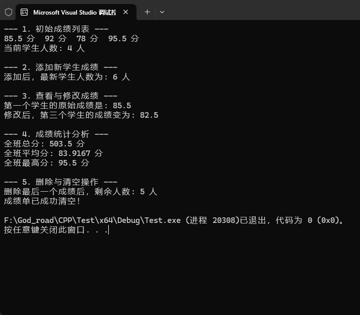

在 C++ 中，**`std::vector`（向量/动态数组）** 是最常用、最基础且最重要的容器之一。

如果你是从 C 语言或者传统数组刚转过来，你可以把它简单理解为：**“一个可以自动变长、自动伸缩的超级数组”**。

---

### 一、 为什么要用 `vector`？（传统数组 vs `vector`）

* **普通数组（静态数组）**：
  必须在定义时固定大小，比如 `int arr[10];`。
  * **缺点**：放满了放不下，放太少又浪费内存，中途不能随时扩展容量。
* **`std::vector`（动态数组）**：
  无需事先确定存放多少个元素。
  * **优点**：想加多少加多少，空间不够时系统**自动帮你扩容**，用起来省心安全！

---

### 二、 `vector` 的核心特点

1. **动态扩容**：随用随加，不需要手动管理内存分配与释放。
2. **连续存储**：在内存中所有元素都是**紧挨着排列**的，因此通过下标访问（如 `vec[0]`）速度极快（时间复杂度为 $O(1)$）。
3. **功能丰富**：STL 提供了丰富的内置函数，如尾插、删除、清空、获取长度等。

---

### 三、 快速上手：常用操作与代码示例

在使用 `vector` 之前，必须引入头文件：
```cpp
#include <vector>
using namespace std;
```

#### 1. 初始化方式
```cpp
#include <iostream>
#include <vector>

int main() {
    // 1. 创建一个空的 int 向量
    std::vector<int> v1; 

    // 2. 创建并直接初始化内容
    std::vector<int> v2 = {10, 20, 30, 40}; 

    // 3. 创建包含 5 个元素的向量，每个元素初始值都是 99
    std::vector<int> v3(5, 99); 
    
    return 0;
}
```

#### 2. 添加与删除元素
```cpp
std::vector<int> nums;

// 在末尾添加元素 push_back
nums.push_back(10); // nums: [10]
nums.push_back(20); // nums: [10, 20]
nums.push_back(30); // nums: [10, 20, 30]

// 删除末尾元素 pop_back
nums.pop_back();    // nums: [10, 20]
```

#### 3. 访问与获取信息
```cpp
// 1. 获取元素个数 (size)
cout << "当前元素个数: " << nums.size() << endl; // 输出 2

// 2. 判断是否为空 (empty)
if (nums.empty()) {
    cout << "vector 是空的" << endl;
}

// 3. 通过下标访问元素（像普通数组一样）
cout << "第一个元素: " << nums[0] << endl;

// 4. 推荐的安全访问方式 at()（防止越界）
cout << "第二个元素: " << nums.at(1) << endl;
```

#### 4. 遍历 `vector`
C++ 中遍历 `vector` 有多种方式，最推荐**范围 for 循环**：

```cpp
std::vector<string> fruits = {"Apple", "Banana", "Cherry"};

// 方式 1：范围 for 循环（最简洁，C++11 新特性）
for (string fruit : fruits) {
    cout << fruit << " ";
}
cout << endl;

// 方式 2：传统下标遍历
for (size_t i = 0; i < fruits.size(); ++i) {
    cout << fruits[i] << " ";
}
cout << endl;
```

---

### 四、 进阶理解：`size` 与 `capacity` 的区别（底层原理解析）

很多人好奇：**`vector` 是怎么实现自动扩容的？**

这里有两个核心概念：
* **`size()`（大小）**：当前容器里**实际存了多少个元素**。
* **`capacity()`（容量）**：当前系统为你预留的**总内存空间可以存多少个元素**。

> **比喻**：
> 假设你买了一盒能放 10 个鸡蛋的盒蛋架（`capacity = 10`），目前你放了 3 个鸡蛋（`size = 3`）。
> 当你放入第 11 个鸡蛋时，盒蛋架装不下了。`vector` 的做法是：**换一个可以放 20 个鸡蛋的大盒子（通常按 1.5倍 或 2倍 扩容），把原来的 10 个鸡蛋搬过去，再把旧盒子扔掉。**

```cpp
std::vector<int> v;
cout << "Size: " << v.size() << ", Capacity: " << v.capacity() << endl;

for (int i = 0; i < 5; ++i) {
    v.push_back(i);
    cout << "Size: " << v.size() << ", Capacity: " << v.capacity() << endl;
}
```



*小技巧*：如果你提前知道要存 1000 个数据，可以使用 `v.reserve(1000)` 一次性预分配空间，避免频繁扩容搬家带来的开销。

---

### 五、 小白常见踩坑点

1. **数组越界崩溃**：
   `vec[10]` 如果超出实际范围（`size`），不会报错提醒，但可能导致程序运行崩溃或出现垃圾值。推荐使用 `vec.at(10)`，越界时会抛出清晰的异常信息。
2. **在遍历过程中随意修改 `vector` 长度**：
   在 `for` 循环遍历 `vector` 时，如果在循环体内部调用 `push_back()` 或 `erase()`，可能导致迭代器失效，引发未定义行为。

---

### 六、 常用操作速查表

| 操作             | 语法 / 代码                  | 说明                      |
| :--------------- | :--------------------------- | :------------------------ |
| **头文件**       | `#include <vector>`          | 使用前必须包含            |
| **添加末尾元素** | `vec.push_back(val)`         | 在末尾插入元素            |
| **删除末尾元素** | `vec.pop_back()`             | 弹出末尾元素              |
| **访问元素**     | `vec[i]` 或 `vec.at(i)`      | 访问第 i 个元素           |
| **首尾元素访问** | `vec.front()` / `vec.back()` | 获取第一个 / 最后一个元素 |
| **获取当前大小** | `vec.size()`                 | 返回元素总数              |
| **判断是否为空** | `vec.empty()`                | 若为空返回 `true`         |
| **清空所有元素** | `vec.clear()`                | 清空内容，`size` 变为 0   |

---

### 总结
对于 C++ 初学者来说，**只要需要用到“一组相同类型的变量”，优先选择 `std::vector`**！它比 C 语言原始数组更安全、更强大、用起来也更方便。


# 使用实例

```cpp
#include <iostream>
#include <vector>   // 1. 必须引入 vector 头文件
#include <numeric>  // 用于后面方便计算总分 (std::accumulate)

using namespace std;

int main() {
    // ==========================================
    // 步骤 A: 创建 vector 并初始化
    // ==========================================
    // 创建一个用来存放 double 类型成绩的动态数组
    vector<double> scores = { 85.5, 92.0, 78.0, 95.5 };

    cout << "--- 1. 初始成绩列表 ---" << endl;
    // 使用范围 for 循环打印所有成绩
    for (double s : scores) {
        cout << s << " 分  ";
    }
    cout << "\n当前学生人数: " << scores.size() << " 人\n\n";

    // ==========================================
    // 步骤 B: 动态添加新元素 (push_back)
    // ==========================================
    cout << "--- 2. 添加新学生成绩 ---" << endl;
    scores.push_back(88.0); // 补考生成绩
    scores.push_back(60.0); // 转学生成绩
    cout << "添加后，最新学生人数为: " << scores.size() << " 人\n\n";

    // ==========================================
    // 步骤 C: 读取与修改指定位置的元素
    // ==========================================
    cout << "--- 3. 查看与修改成绩 ---" << endl;
    // 用 [下标] 或 .at() 访问第1个学生(下标0)
    cout << "第一个学生的原始成绩是: " << scores[0] << endl;

    // 修改第3个学生(下标2)的成绩（加分纠错）
    scores[2] = 82.5; 
    cout << "修改后，第三个学生的成绩变为: " << scores.at(2) << endl << endl;

    // ==========================================
    // 步骤 D: 统计计算（遍历 vector）
    // ==========================================
    cout << "--- 4. 成绩统计分析 ---" << endl;
    double sum = 0.0;
    double maxScore = scores[0]; // 假设第一个最高

    for (size_t i = 0; i < scores.size(); ++i) {
        sum += scores[i]; // 累加求和
        
        // 寻找最高分
        if (scores[i] > maxScore) {
            maxScore = scores[i];
        }
    }

    double average = sum / scores.size();

    cout << "全班总分: " << sum << " 分" << endl;
    cout << "全班平均分: " << average << " 分" << endl;
    cout << "全班最高分: " << maxScore << " 分" << endl << endl;

    // ==========================================
    // 步骤 E: 删除最后一个元素 (pop_back) 与 清空
    // ==========================================
    cout << "--- 5. 删除与清空操作 ---" << endl;
    // 误录入了最后一个学生，删除末尾成绩
    scores.pop_back(); 
    cout << "删除最后一个成绩后，剩余人数: " << scores.size() << " 人" << endl;

    // 清空整个成绩单
    scores.clear();
    if (scores.empty()) {
        cout << "成绩单已成功清空！" << endl;
    }

    return 0;
}
```

