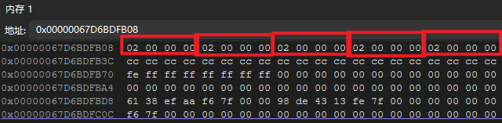

# 数组和指针

数组的本质上就是**指针加上偏移量**

```cpp
int arr[5];
arr[1] = 2;
```

```cpp
int* ptr = arr;
*(ptr + 1) = 6;//+1、+2指的是需要找到的位置所偏移的字节对应需要几个数据类型
```

指针存放数组的地址，通过偏移量并解引用，找到对应第几个元素，将其值进行修改

# 栈上创建数组

```cpp
int arr[5]; //创建了5个int大小的数组
```

数组在内存中是连续存放的



在**栈**上创建的数组，出了作用域会**自动销毁**

# 堆上创建数组

如果想返回的是**在函数内新创建的数组**，就得要用new来创建数组，即在**堆**上创建

在堆上创建的数组，需要自己**手动delete释放**

```cpp
int* arr = new int[5];

delete[] arr;
```

如果要找到这块内存，需要用到**间接寻址**，因为arr是一个指针，存放的是这块内存的地址，再通过arr的存放的地址才能找到这块数组的内存所在


# C++11标准中的数组

以**获取数组的大小**为例子

- **原生数组**

```cpp
int arr[5];
int size = sizeof(arr)/sizeof(arr[0]);//或者int size = sizeof(arr) / sizeof(int);
```

还可以根据自己的需要来手动维护数组的大小

```cpp
static const int arrSize = 5;
int arr[arrSize];
```

这样就可以知道自己创建的数组的大小是多少了


- **C++11**

> 通过`std::arry`

```cpp
#include<array>
std::array<int , 5> arr;
int size = arr.size();
```

这是一种很简单的处理方法，但也会有额外的开销，因为它会自动做边界检查，实际上也维持着一个整数size

