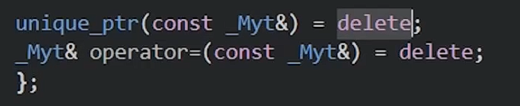

要使用这些指针指针，首先需要**引用头文件**`#include<memory>`

# 作用域指针

`unique_ptr`

```cpp
#include<iostream>
#include<memory>
class Entity
{
public:
	Entity()
	{
		std::cout << "Ctreated Entity!" << std::endl;
	}

	~Entity()
	{
		std::cout << "Destroyed Entity!" << std::endl;
	}
};
int main()
{
	{
		std::unique_ptr<Entity> entity = std::make_unique<Entity>();
	}
	

	std::cin.get();
}
```

当出了这个局部作用域之后，会自动释放内存

```cpp
{
	std::unique_ptr<Entity> entity = std::make_unique<Entity>();
}
```

使用make_unique<>是为了在**抛出异常**的时候更安全


- 使用作用域指针不应该对这个指针进行复制操作(即使用复制运算符`=`)

如果复制了指针，说明有两个指针指向同一块内存，如果自动释放内存后，有另一个指针还是会指向已经释放内存的那块指针，就会出问题



copy构造和copy复制操作实际上已经被禁止了

(即底层已经把**拷贝构造**删除了)


# 共享所有权智能指针

## 1. 核心概念

`shared_ptr` 采用 **共享所有权（Shared Ownership）** 模式。**多个 `shared_ptr` 可以同时指向同一个对象**。

## 2. 工作原理：引用计数（Reference Counting）

- 内部维护了一个**控制块（Control Block）**，其中记录了当前指向该对象的 `shared_ptr` 数量（**强引用计数**）。
- 每当拷贝一个 `shared_ptr`，强引用计数 **+1**。
- 每当一个 `shared_ptr` 析构或被重置，强引用计数 **-1**。
- 当强引用计数降为 **0** 时，系统会**自动调用对象的析构函数并释放内存**。

## 3. 基本用法

```cpp
#include <memory>
#include <iostream>

struct MyClass {
    MyClass() { std::cout << "构造函数\n"; }
    ~MyClass() { std::cout << "析构函数\n"; }
};

int main() {
    // 推荐使用 make_shared（性能更好、内存一次性分配）
    std::shared_ptr<MyClass> ptr1 = std::make_shared<MyClass>(); // 计数 = 1
    {
        std::shared_ptr<MyClass> ptr2 = ptr1; // 拷贝，计数 = 2
        std::cout << "当前引用计数: " << ptr1.use_count() << "\n"; // 输出 2
    } // ptr2 离开作用域，计数 = 1

    std::cout << "当前引用计数: " << ptr1.use_count() << "\n"; // 输出 1
    return 0; // main 结束，ptr1 析构，计数降为 0，自动释放 MyClass
}
```

# 弱引用智能指针

> ##### 为什么需要 `std::weak_ptr`？
>
> 虽然 `shared_ptr` 很强大，但它有一个**致命缺陷**：**循环引用（Circular Dependency）导致内存泄漏**。

`weak_ptr` 就是为了解决 `shared_ptr` 的循环引用而生的。

#### 1. 核心特征

- **不增加强引用计数**：它只旁观对象，**不拥有**对象的所有权。
- **不能直接访问对象**：它没有 `*` 或 `->` 运算符。
- 如何安全使用：使用`.lock()`方法尝试将其提升为`shared_ptr`：
  - 如果对象还活着，返回一个有效的 `shared_ptr`（强引用计数 +1）。
  - 如果对象已被销毁，返回 `nullptr`。

```cpp
struct B;

struct A {
    std::shared_ptr<B> ptrB;
    ~A() { std::cout << "A 被销毁\n"; }
};

struct B {
    std::weak_ptr<A> ptrA; // 关键修改：改用 weak_ptr
    ~B() { std::cout << "B 被销毁\n"; }
};

int main() {
    auto a = std::make_shared<A>();
    auto b = std::make_shared<B>();

    a->ptrB = b;
    b->ptrA = a; // 赋值给 weak_ptr，不会增加 A 的强引用计数

    // 安全访问 weak_ptr：
    if (std::shared_ptr<A> lockedA = b->ptrA.lock()) {
        std::cout << "A 仍然存活\n";
    } else {
        std::cout << "A 已经被释放\n";
    }

    return 0; // 正常释放 A 和 B！
}
```

