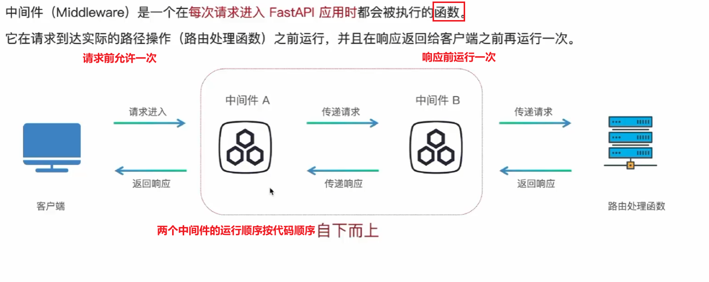
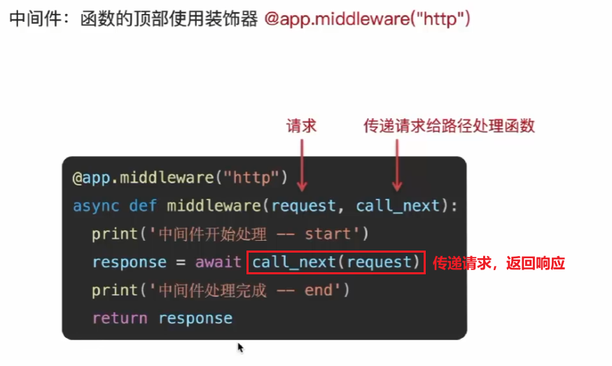

# 中间件




> 在FastAPI下面的情况中可以使用中间件为每个请求前后添加统一的处理逻辑
>
> 1. **多个接口**都需要**验证用户身份**
> 2. **多个接口**都需要**记录日志、性能数据**

实际开发中中间件被使用的情景

- 日志记录
- 身份验证
- 跨域处理
- 响应头处理
- 性能监控

## 中间件的使用



```python
from fastapi import FastAPI

app = FastAPI()

@app.middleware("http")
async def middleware1(request,call_next):
    print("中间件1 start")
    response = await call_next(request)
    print("中间件1 end")
    return response

@app.middleware("http")
async def middleware2(request,call_next):
    print("中间件2 start")
    response = await call_next(request)
    print("中间件2 end")
    return response

@app.get("/")
async def root():
    return{"message":"Hello world"}
```

**执行顺序：**


**按代码顺序自下而上：**

先执行中间件2，然后再执行中间件1，在等中间件1结束后，中间件2才结束