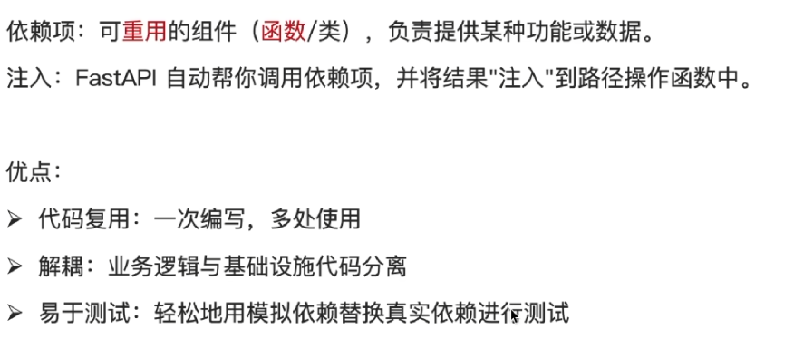

# 依赖注入



> 和中间件不同的是：
>
> - 当开发中需要控制**所有请求都有的通用代码**，就使用**中间件**
> - 如果想指定**哪些接口需要**，那**就用依赖注入**

## 依赖注入场景


## 依赖注入的使用


```python
#导入Depends包
from fastapi import FastAPI,Query,Depends

#创建依赖项
async def common_parameters(
        skip:int = Query(0,ge = 0,le = 10),
        limit:int = Query(10,le = 60)
):
    return{"skip":skip,"limit":limit}

#注入依赖项
@app.get("/news/news_list")
async def get_news_list(commons = Depends(common_parameters)):
    return commons

@app.get("/user/user_list")
async def get_user_list(commons = Depends(common_parameters)):
    return commons
```

