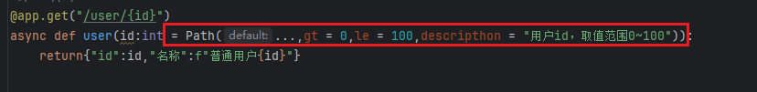
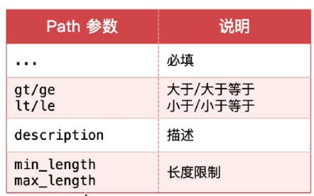
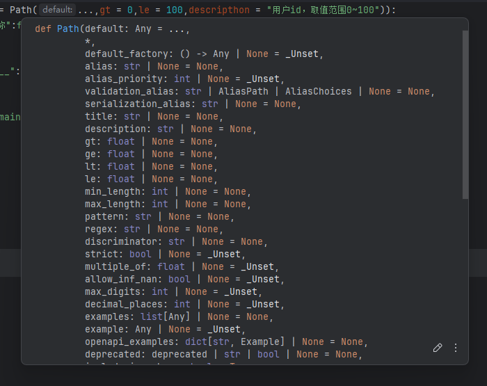
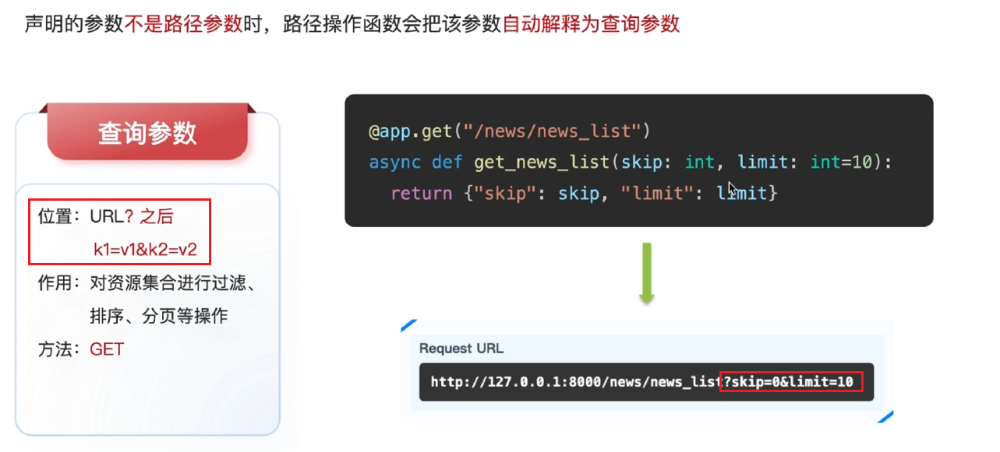
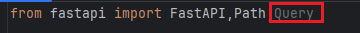
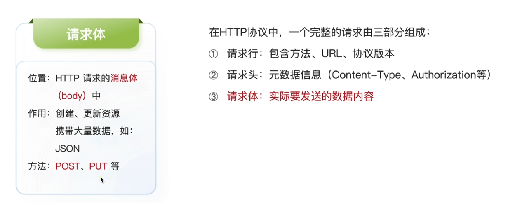
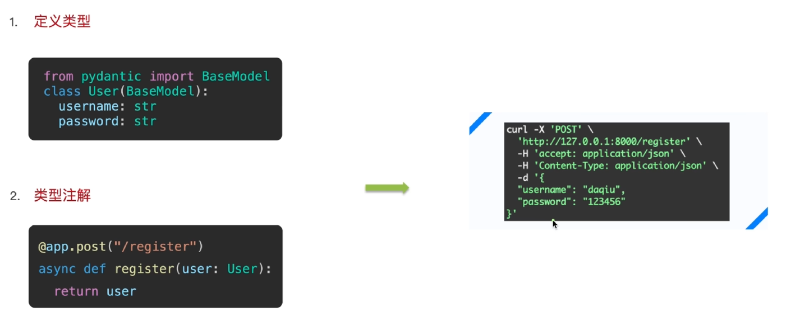
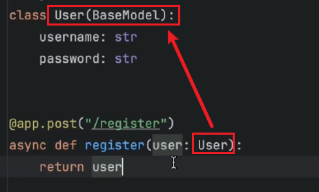
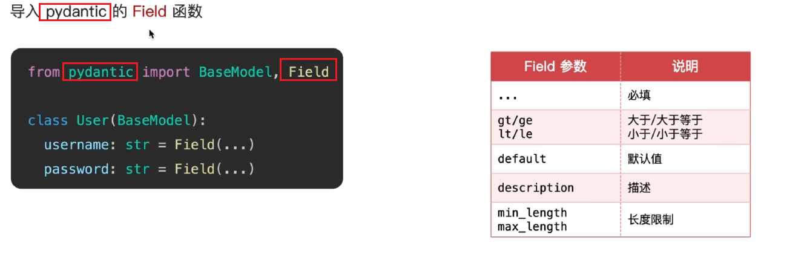

# 路由的基础结构


# 参数分类


## 路径参数


### 类型注解Path

- 导入Path

  ```python
  from fastapi import FastAPI,Path#在开头追加导入Path
  ```

- 使用

  

- 参数

  - 常用参数

    

    > …表示该参数必填
    >
    > int的大小限制用gt/ge或lt/le
    >
    > str的长度限制用min_length或max_length

  - 其他参数

    > 将鼠标移动到Path关键词上面就可以看到其他参数
  
    


## 查询参数



> 查询参数允许赋值默认值

### 类型注解Query

- 导入

  

- 使用

  

  > …表示该参数必填可以改成具体的默认值
  >
  > 其他使用方法和路径参数的Path使用方法相同


## 请求体参数





- 导入

  ```python
  from pydantic import BaseModel
  ```

  

- 使用

  

  > User类继承BaseModel类,user则实例化User类

### 类型注解Field



