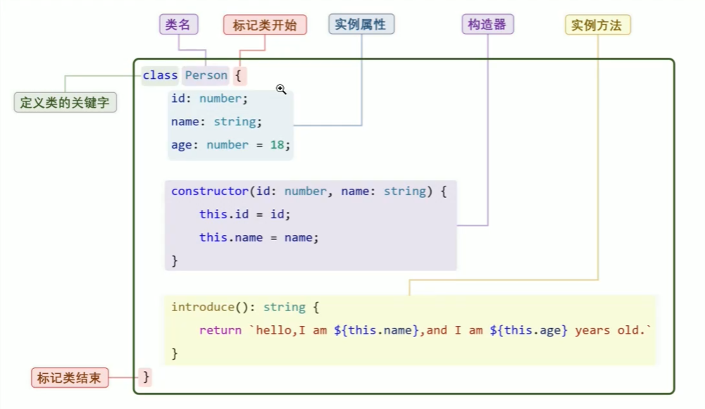
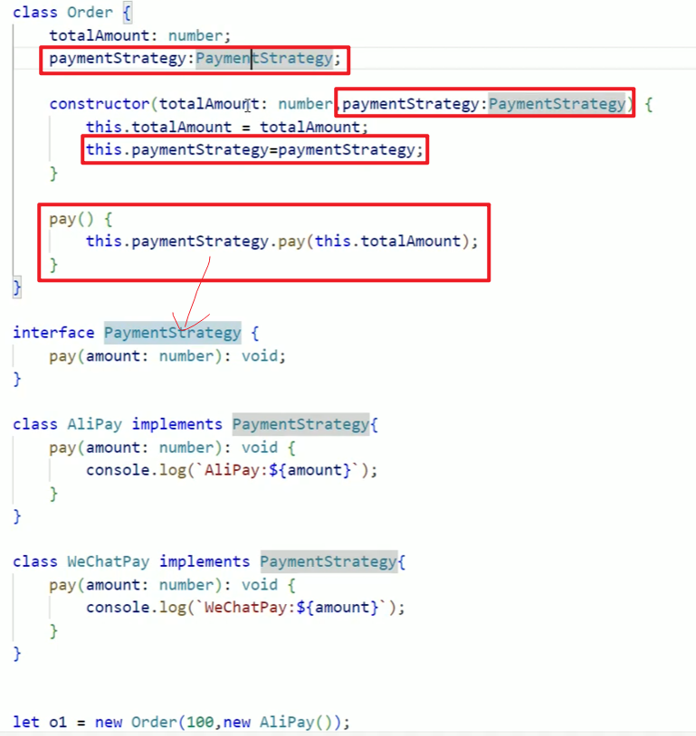
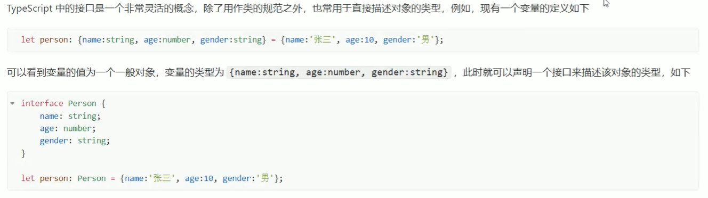
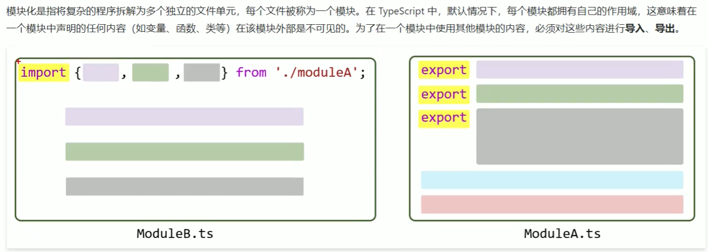
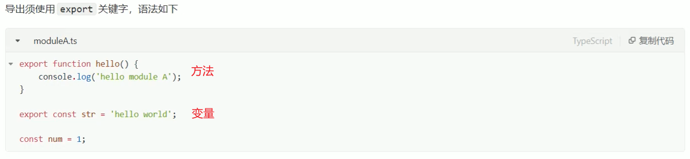
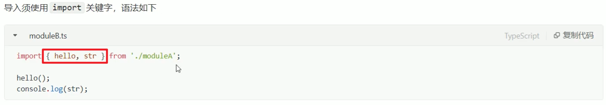
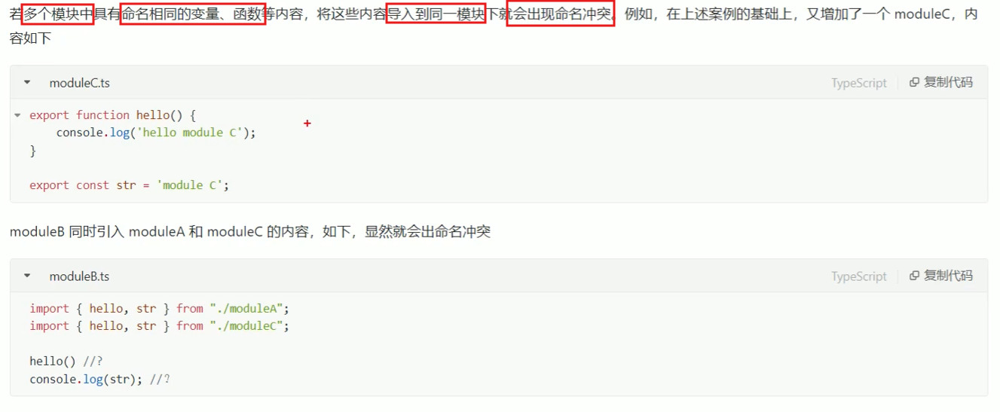
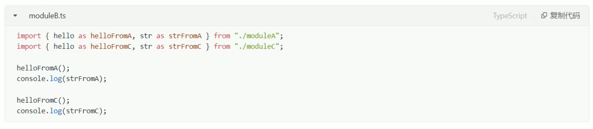
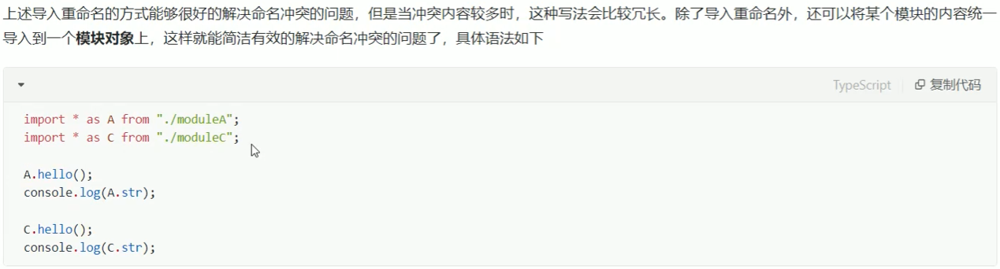
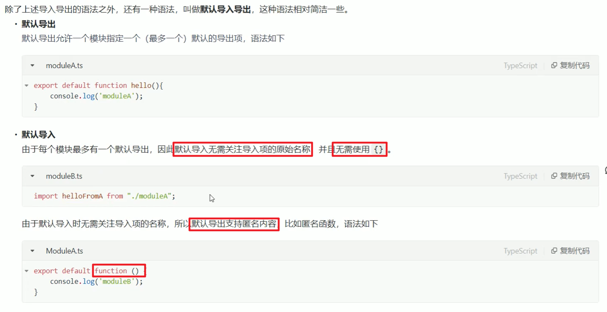

# TypeScript

## 声明

### 变量声明


### 常量声明

```ts
const b:number = 200;
```

### 类型推断

如果一个变量或常量的声明赋值了，TS便可以根据初始值推断类型，此时可以不需要显示指定类型

```ts
let c = 30;
console.log(typeof c);//输出number
```

## 数据类型

### number

`number`表示数字，包括整数和浮点数

```ts
let a:number = 100;
let b:number = 3.5;
let c:number = -20;
let d:number = -5.6;
```

### string

`string`表示字符串，赋值的时候不分单、双引号

```ts
let a:string = '你好';
let b:string = "hello"
```

### boolean

`boolean`表示布尔值，`true`、`false`

```ts
let isOpen:boolean = true;
let isDone:boolean = false;
```

### 数组

```ts
let a:number[] = [];
let b:string[] = ['你好','hello'];
```

``` ts
let a:number[] = [1,2,3,4];
console.log(a[0]);
```

### 对象

```ts
let person:{name:string,age:number} = {name:"覃金焱",age:21};
console.log(person.name); 
```

## 函数

### 声明


### 参数类型

#### 可选参数

```ts
function getPersonInfo(name:string,age:number,gender?:string):string
{
    if(gender === undefined)
        {
            gender = '未知';
        }
    return `name:${name},age:${age},gender:${gender}`;
}
```

上面的gender参数在传参的时候可传可不传，加一个`?`表示

注: 调用函数时，未传递可选参数，则参数的值为`undefined`。

**模板字符串**：return `name:${name},age:${age0},gender:${gender}`

#### 默认参数

```ts
function getPersonInfo(name:string,age:number,gender:string = "未知"):string
{
    return `name:${name},age:${age},gender:${gender}`;
}
```

#### 联合类型

一个函数可能用于处理**不同类型**的值

```ts
function printNumberOrString(message : number | string)
{
    console.log(message);
}
```


#### 任意类型

若函数需要处理**任意类型**的值，则可以使用any类型

```ts
function print(message:any)
{
    console.log(message);
}
```

### 返回值

#### void

```ts
function test():void
{
    console.log('hello');
}
```


#### 类型推断

函数返回值的类型可以根据函数内容推断出来，因此可以省略不写

```ts
function test()
{
    console.log('hello');
}

function sum(a:number,b:number)
{
	return a+b;
}
```

### 匿名函数

匿名函数的语法简洁，特别适用于简单且仅需一次性使用的场景

```ts
//正常函数
let arr1:number[] = [1,2,3,4,5];
arr1.forEach(print);

function print(item:number)
{
    console.log(item);
}

//匿名函数
let arr2:number[] = [1,2,3,4,5];
arr2.forEach(function (item)
{
    console.log(item);
});
```

匿名函数可以根据上下文推断出参数类型，因此参数类型可以省略

### 箭头函数

箭头函数由匿名函数简化而来，只保留参数列表和函数体两个核心部分，两者用`=>`连接

```ts
let arr2:number[] = [1,2,3,4,5];
arr2.forEach((item)=>
{
    console.log(item);
});
```

如果只有一个参数，item的小括号可以删去

如果只有一行代码，`{}`可以删去

## 类

### 定义语法



### 对象的创建

```ts
let person = new Person(1,"zhangsan");
```

### 对象属性的访问

```ts
console.log(person.name);//读

person.name = "lisi"//写

console.log(person.introduce());//读
```

### 接口&多态



#### 特殊用法



## 模块化



### 导出



### 导入



from后面加的是**相对路径(注意不需要加后缀)**

### 避免命名冲突



#### 导入重命名



#### 创建模块对象



### 默认导入导出



