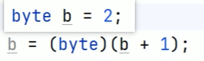
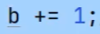
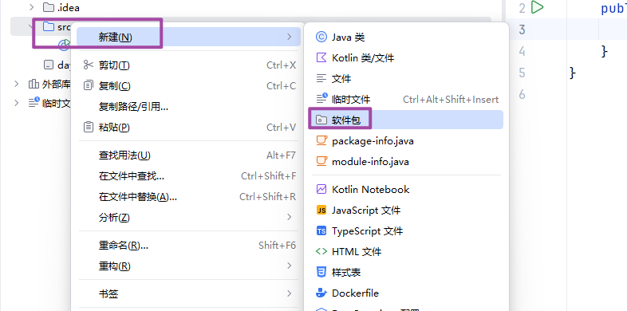
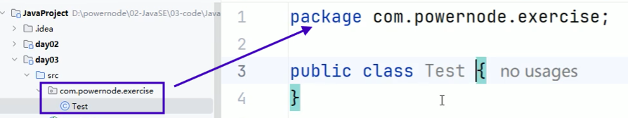
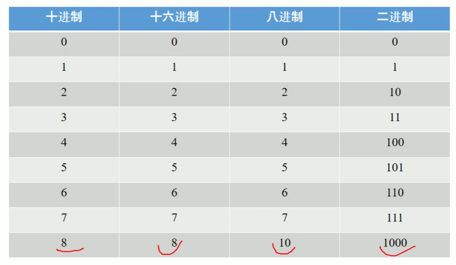

# 基本语法

编写 Java 程序时，应注意以下几点：

- **大小写敏感**：Java 是大小写敏感的，这就意味着标识符 Hello 与 hello 是不同的。

- **类名**：对于所有的类来说，**类名的首字母应该大写**。如果类名由**若干单词**组成，那么**每个单词**的**首字母应该大写**，例如 **MyFirstJavaClass** 。

- **方法名**：所有的**方法名**都应该**以小写字母开头**。如果方法名含有若干单词，则**后面的每个单词首字母大写**。

- **源文件名**：**源文件名必须和类名相同**。当保存文件的时候，你应该使用类名作为文件名保存（切记 Java 是大小写敏感的），文件名的后缀为 **.java**。

  （如果**文件名和类名不相同则会导致编译错误**）。

- **主方法入口**：所有的 Java 程序由 **public static void main(String[] args)** 方法开始执行。

# 编写一个类

> **main方法写在类体里面**

```java
public class HelloWorld {
    public static void main(String[] args)
    {
        System.out.println("牛逼");
    }
}
```

- 输出括号里面，数字不用双引号`""`,其他都需要加上

# public修饰符

> 使用public修饰的类，类名称和文件名称必须一样，否则报错


# 变量

> 变量是存储数据的容器

### 数据类型

1. 基本类型

   - **整型**

   - **浮点型**

   - **字符型**

   - **布尔型**

2. 引用类型（除了基本类型外都是引用类型）

### 变量名称

**规则**：数字不可以开头，不可以使用java关键字和保留字

**规范**：变量和方法命名一样，**首单词小写，其余单词首字母大写**

### 容器

> 变量相当于一个容器，在内存中开辟了一块空间


# 运算符

### 二元运算符

> **加、减、乘、除、取余**

```java
public class test
{
    public static void main(String[] args) {
        int a = 100;
        int b = 10;
        System.out.println(a + b);
        System.out.println(a - b);
        System.out.println(a * b);
        System.out.println(a / b);
        System.out.println(a % b);
    }
}
```


### 一元运算符

> **正、负、前后递增、前后递减**


### 赋值运算符

> **直接赋值、复合赋值(+=、-=、/=、*=、%=)**

### 三目运算

语法：<条件表达式> ? <表达式1> :<表达式2>

执行过程：

   1.<条件表达式>

2. true:返回<表达式1>的结果

​        false:返回<表达式2>的结果


# 强制转换



如果使用+=运算，会默认进行强转


# 包

> java对类的管理使用包




包的命名都使用小写，公司里面一般前面写的是域名的倒写，如百度`com.baidu.xx`


创建包后，在计算机里面是会根据`.`来分隔，创建出多个文件夹，一个`.`对应硬盘上就是一个文件夹


在包里面可以创建类



第一行代码表示该类属于这个包


# 进制



八进制，逢八进一，7+1->10,17+1->20,27+1->30…..

- 十六进制使用0x作为前缀:0x5
- 八进制使用0作为前缀:05

