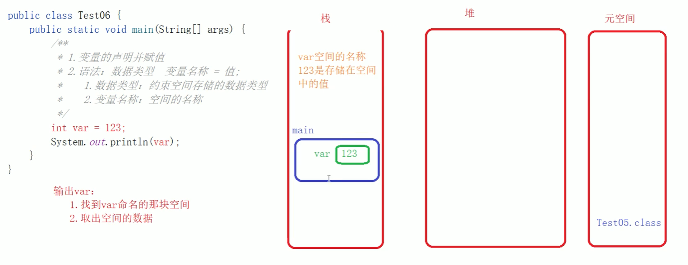
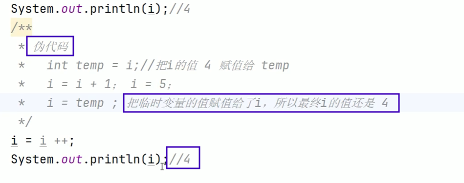

# 第一章：认识Java

## 编写一个类

> **main方法写在类体里面**

```java
public class HelloWorld {
    public static void main(String[] args)
    {
        System.out.println("牛逼");
    }
}
```

- 输出括号里面，数字不用双引号`""`,其他都需要加上

## public修饰符

> 使用public修饰的类，类名称和文件名称必须一样，否则报错

# 第二章：变量与运算符

## 变量

> 变量是存储数据的容器

### 数据类型

1. 基本类型

   - **整型**

   - **浮点型**

   - **字符型**

   - **布尔型**

2. 引用类型（除了基本类型外都是引用类型）

### 变量名称

**规则**：数字不可以开头，不可以使用java关键字和保留字

**规范**：变量和方法命名一样，**首单词小写，其余单词首字母大写**

### 容器

> 变量相当于一个容器，在内存中开辟了一块空间



## 运算符

### 二元运算符

> **加、减、乘、除、取余**

```java
public class test
{
    public static void main(String[] args) {
        int a = 100;
        int b = 10;
        System.out.println(a + b);
        System.out.println(a - b);
        System.out.println(a * b);
        System.out.println(a / b);
        System.out.println(a % b);
    }
}
```


### 一元运算符

> **正、负、前后递增、前后递减**



### 赋值运算符

> **直接赋值、复合赋值(+=、-=、/=、*=、%=)**


