# 一条数据的存储过程

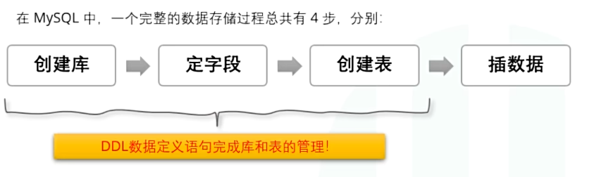

# 数据库定义语句介绍

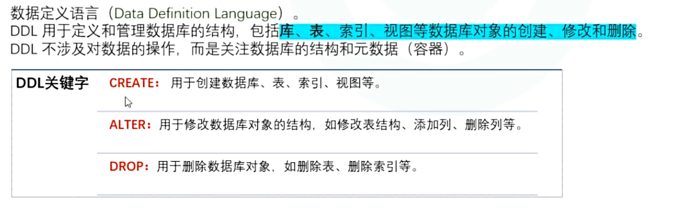

# SQL命名规定和规范

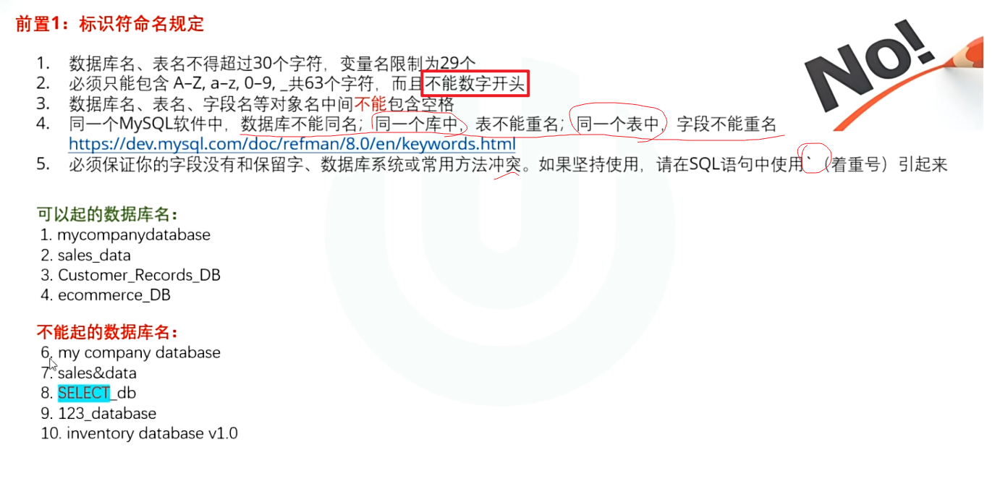

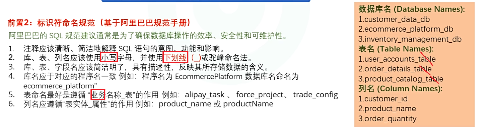

# 库管理

## 创建库

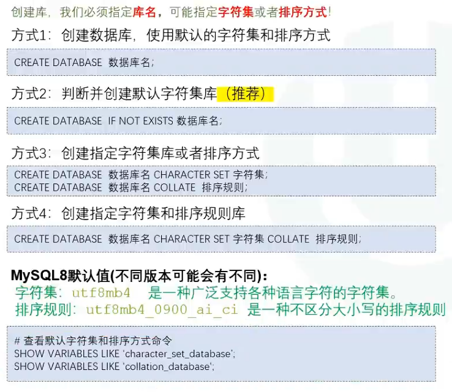

### 字符集和排序规则

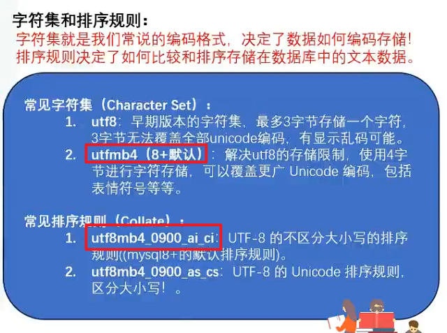

假设表中有一条数据 `username = 'Admin'`：

- 使用 `_ci`（如 `utf8mb4_0900_ai_ci`）**不区分大小写**：
  - 查询 `WHERE username = 'admin'` **能**匹配到 `'Admin'`。
  - 若字段有唯一索引（`UNIQUE`），插入 `'admin'` 会**报错主键/唯一冲突**。
- 使用 `_cs`（如 `utf8mb4_0900_as_cs`）**严格区分大小写**：
  - 查询 `WHERE username = 'admin'` **无法**匹配到 `'Admin'`。
  - 唯一索引允许 `'admin'` 和 `'Admin'` 同时存在。


## 查看库和使用库

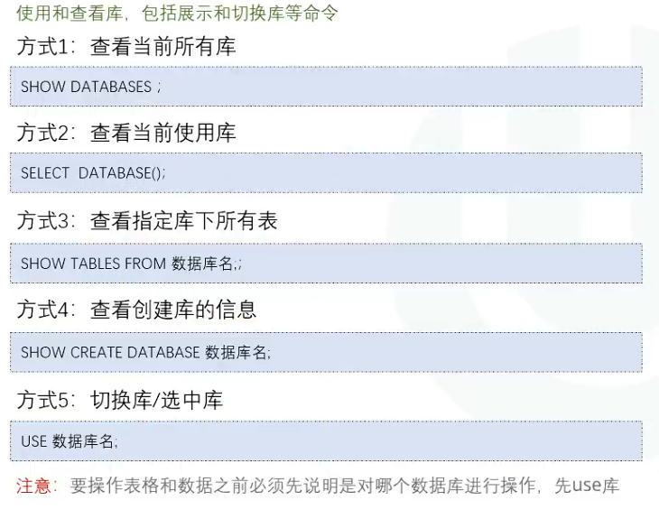

## 修改库

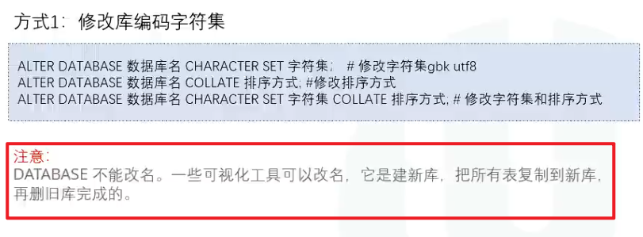

## 删除库

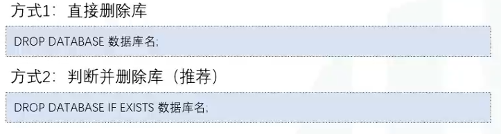

#  表管理

## 创建表

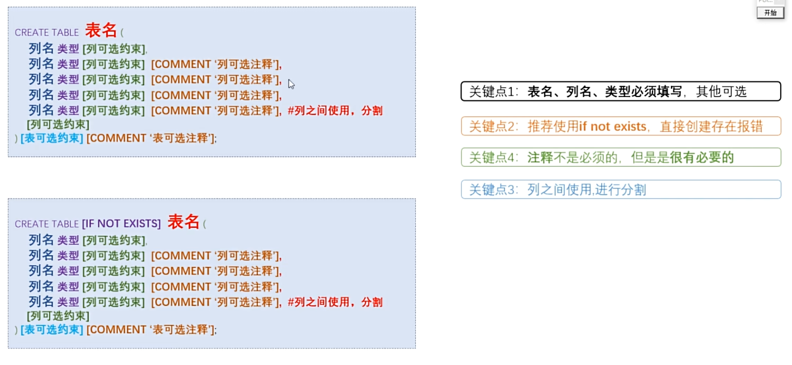

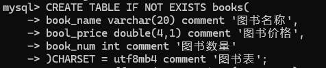

> **其中的double(4,1)中的`(4,1)`表示前面三位整数，后面一位小数，共四位**

### 字段常用类型

#### 整数类型

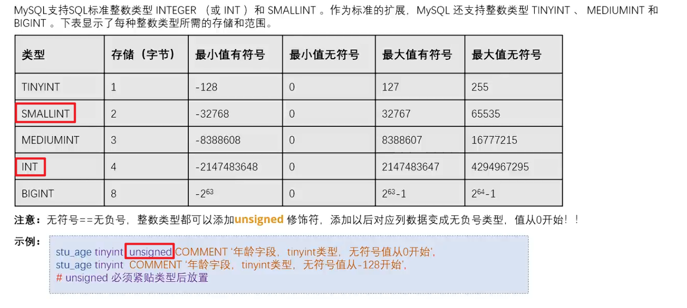

#### 浮点和定数类型

- **浮点型**

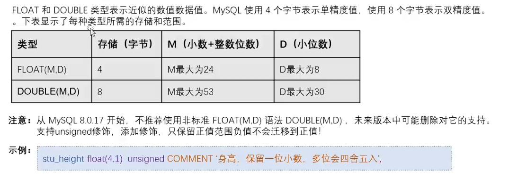

- **定点数**

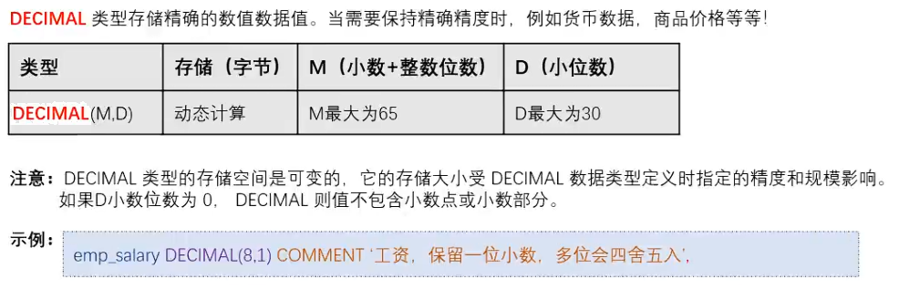

> **精度要求不高**，例如：身高，体重 		    用 **float / double**
>
> **精度要求特别高**，例如：钱，工资，价格 	用 **decimal**

#### 字符串类型

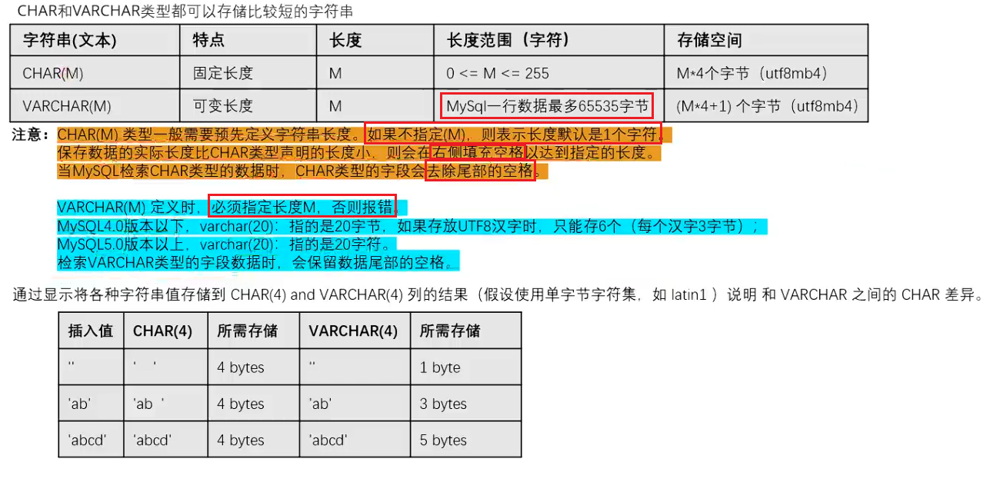

- **文本(TEXT)类型**

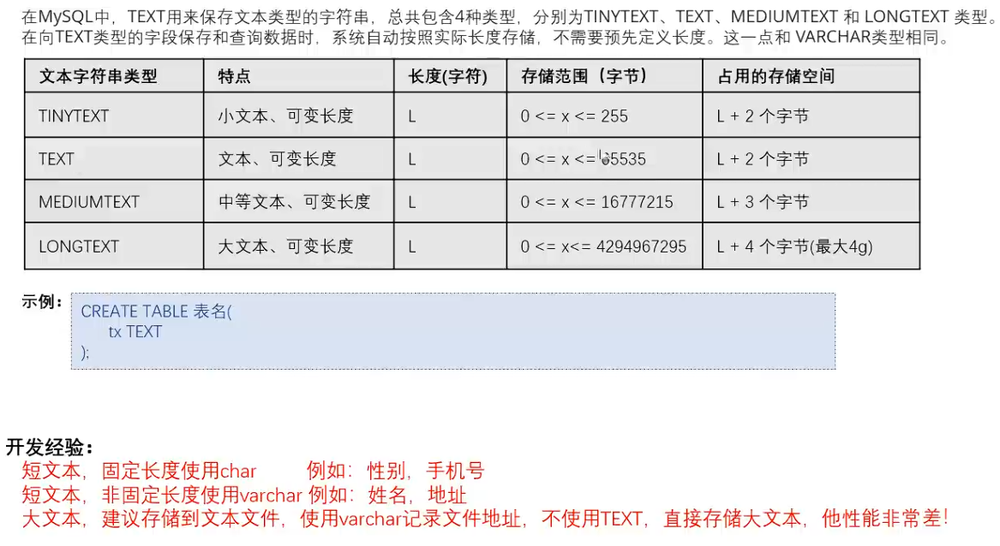

#### 时间类型

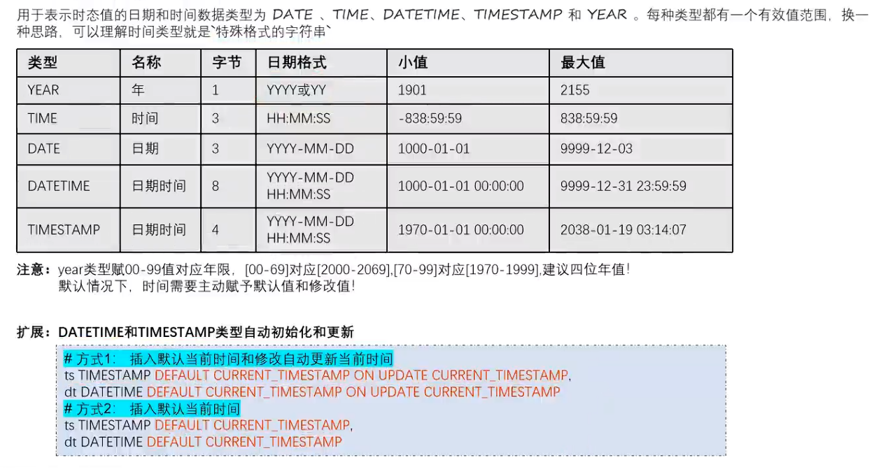

> **时间类型是一个特殊格式的字符串，插入数据的时候要加上单引号``**

#### 拓展：

- **枚举**

```bash
CREATE TABLE employees(
	gender ENUM('男','女') COMMENT '性别'
);
```

> **`ENUM`表示枚举，这列数据只能填写枚举里面的内容**

- **SET**

```bash
CREATE TABLE employees(
	work_place SET('北京','上海','深圳','广州') COMMENT '公司地址'
);
```

> **`SET`表示这列数据可以多选，可以只填写`北京`或填写`北京，深圳`，但也必须在范围内选择**


## 查看表

```bash
DESC 表名;
```

可查看到表中各行的**结构**

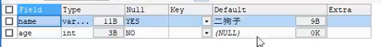

## 修改表

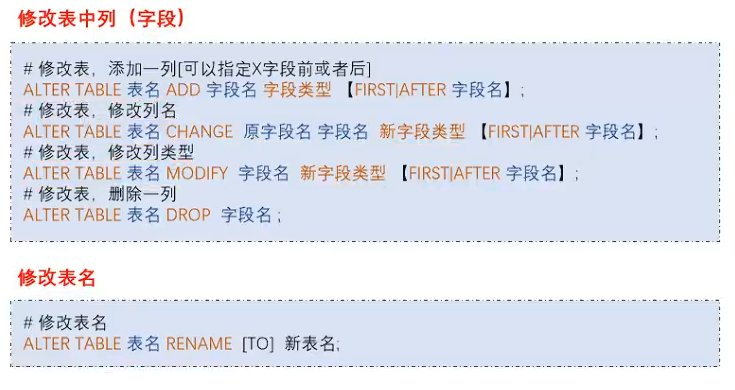

## 删除表

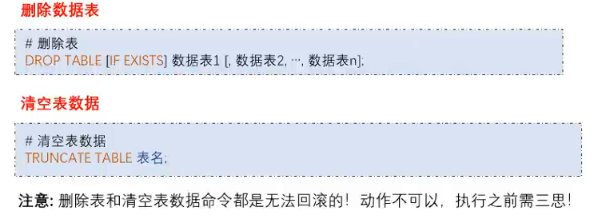

