# DQL概述

## 作用


## 分类


# 单表

##  基础SELECT语法


**注意：**

- **`*`通配符必须放在第一位**
- **`NULL`和任何数据做运算，结果都等于NULL(加减乘除)**
  - 解决方法：IFNULL(列名，默认值)
  - 如果该列为空，则变为默认值


> #### 查询常数详解
>
> 


## 显示表结构


## 过滤条件


# 运算符的使用

## 算数运算符


## 比较运算符


> **``非标准`表示只能在MySQL使用，在其他数据库不能使用**


## 逻辑运算符

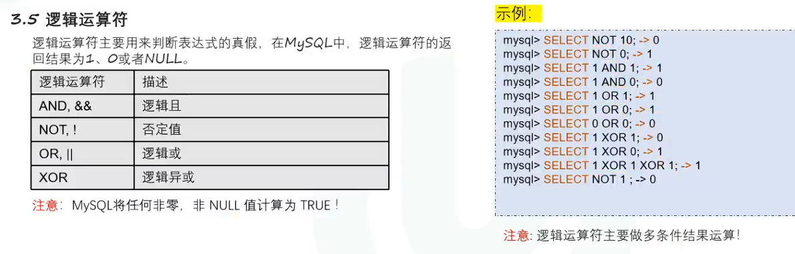

**拓展用法：FIND_IN_SET**

```bash
FIND_IN_SET('值',列名)
```

查找**值**是否出现，出现则输出**1**，没有出现则**0**


## 运算符优先级

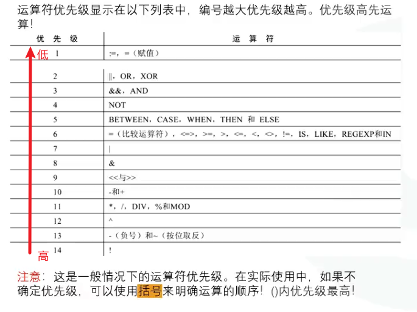

# 单行函数

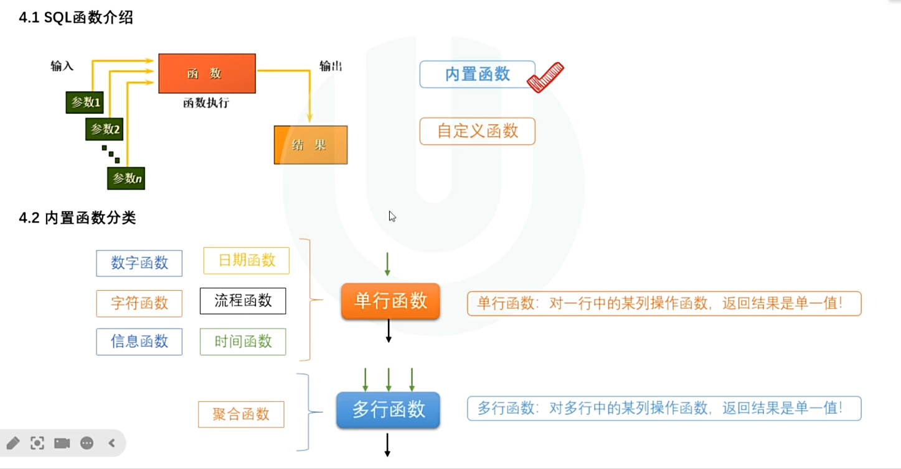

## 数值函数

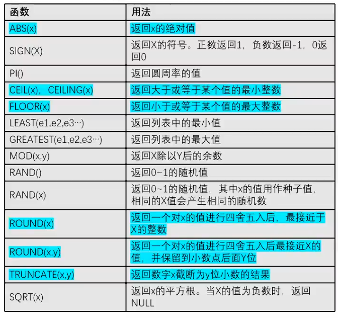

## 字符串函数

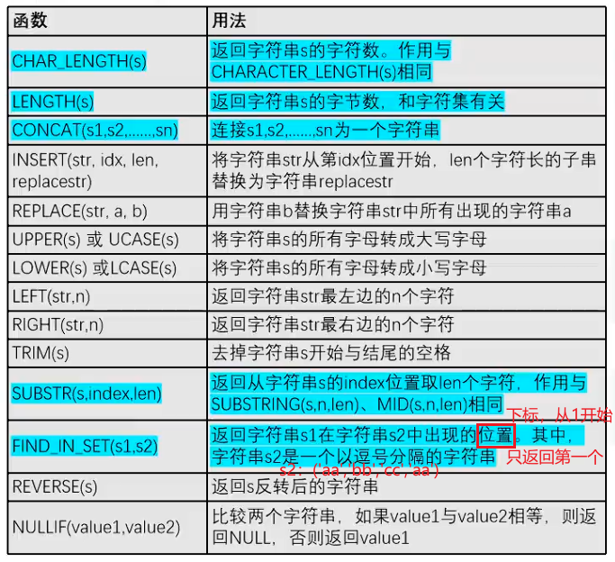

## 时间函数

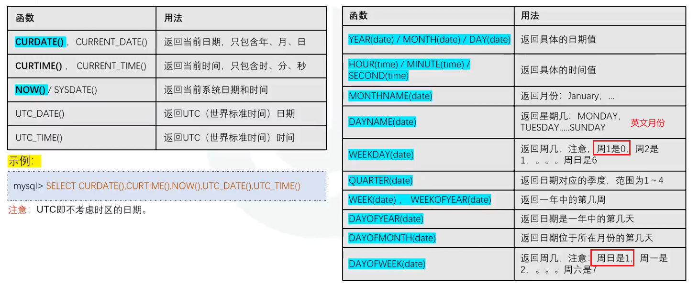


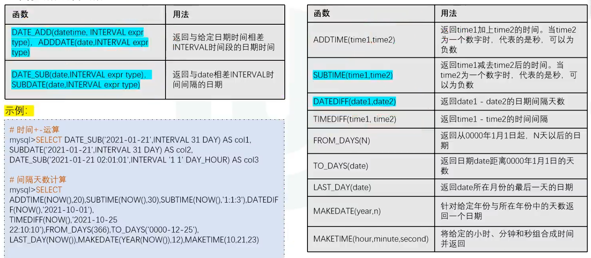


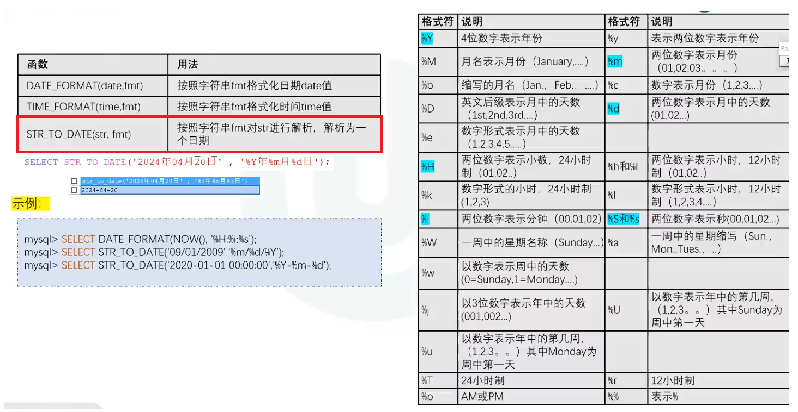


## 流程函数

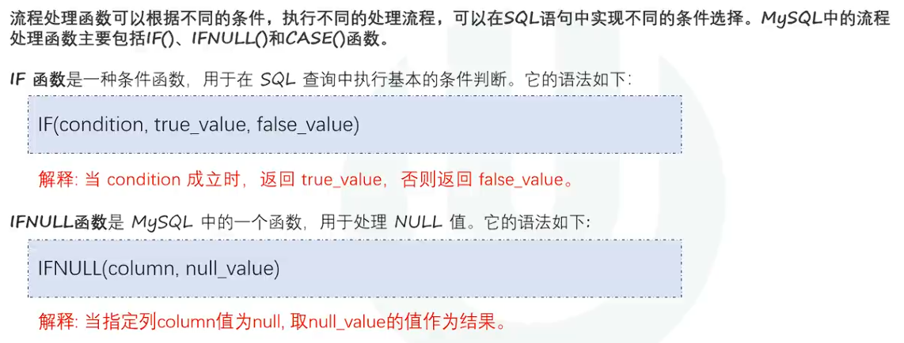


CASE 是 SELECT 里面的表达式，**前面要有逗号**，并且最后才是 FROM books;

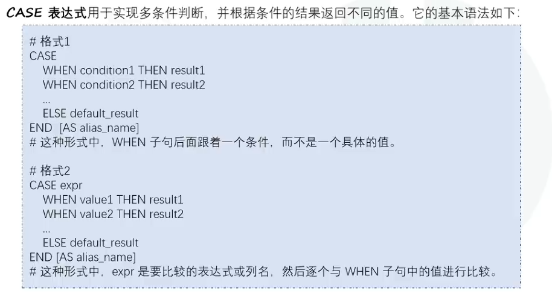


# 多行函数

## 聚合函数

> #### 聚合函数作用于全部或者分组数据进行统计和计算，最终返回一条结果


# 分组查询


> #### where是分组前的条件，HAVING是分组后的条件

## 合计

**在最后加上：**

```bash
WITH ROLLUP #在分组汇总后增加合计行
```

**在SELECT后面加上：**

```bash
IFNULL(根据分组的列名, '合计') #把 ROLLUP 产生的 NULL 分组名显示为“合计”
```


# 排序查询


> #### 正序：从小到大
>
> #### 倒序：从大到小


# 数据切割(分页查询)

> #### 下面的语法适用于MySQL,其他数据库可能会是不同的语法

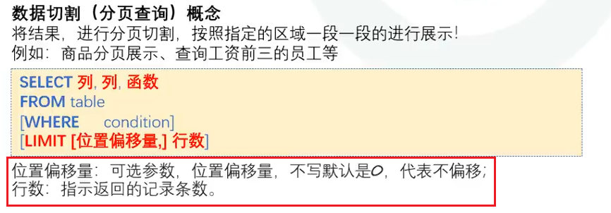

​				**LIMIT 必须放在整个SELECT语句的最后**


```bash
LIMIT 0,2; #或(LIMIT 2;)
```

从第0行开始查询，查找2行

**如果查询的行数大于数据库实际存在的数据行数，则最后只会返回实际存在的几行数据**


#  高级查询处理


> #### 根据SELECT语句的执行顺序，可解释下面问题


> #### 取别名是属于SELECT的字段，WHERE的执行顺序早于SELECT的字段，此时别名列还未生成，WHERE不可使用别名列，GROUP BY、ORDER BY和HAVING也不行


> #### 但是在MySQL8以后，GROUP BY、ORDER BY或HAVING中优化了，可以使用别名列


