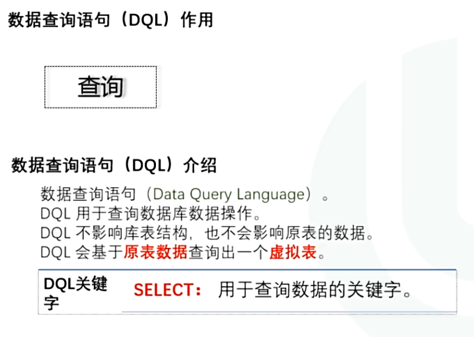
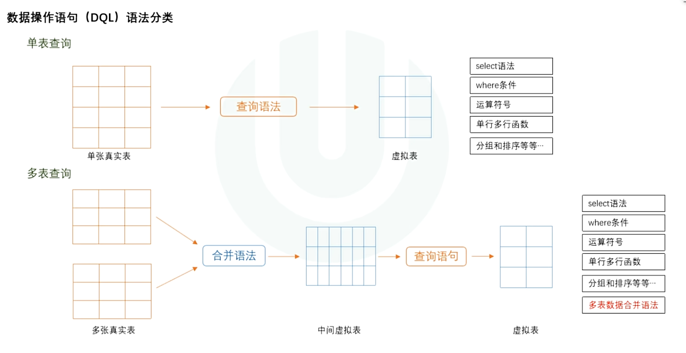
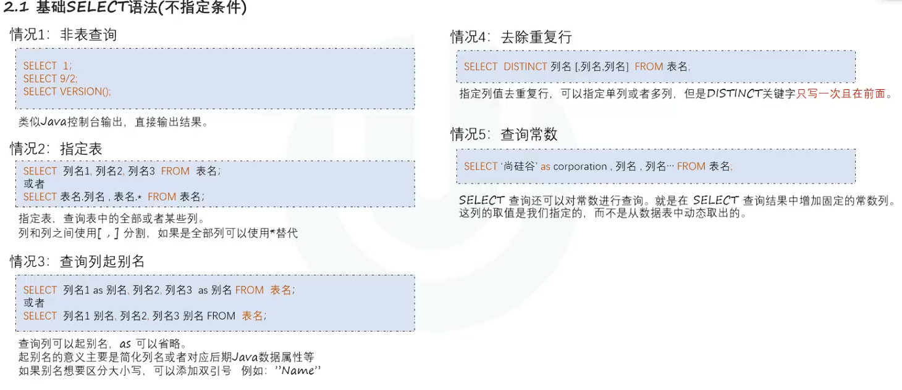
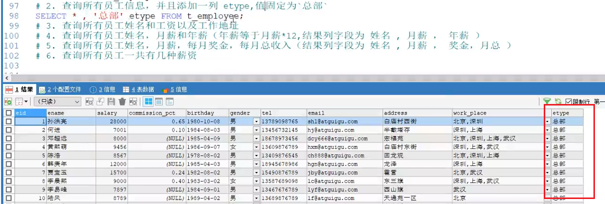
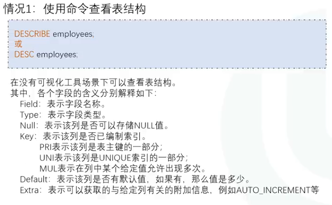
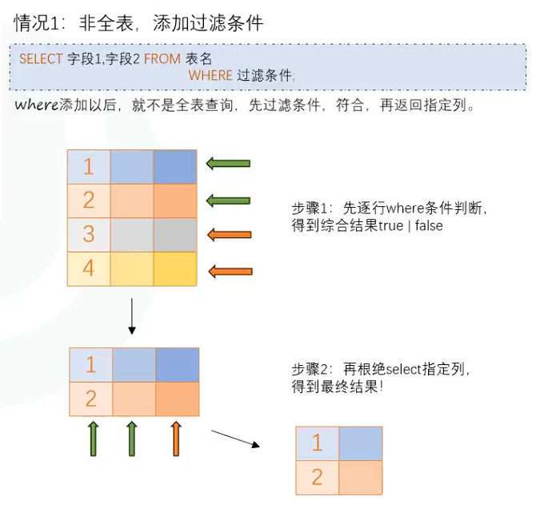
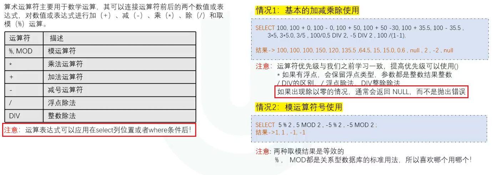
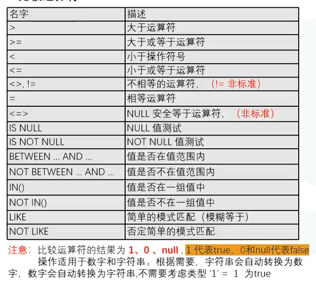
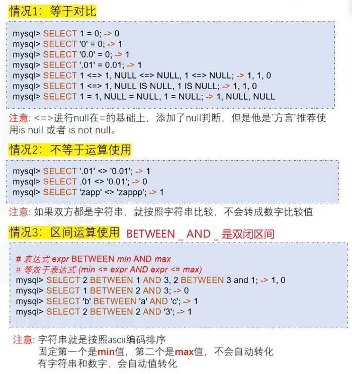
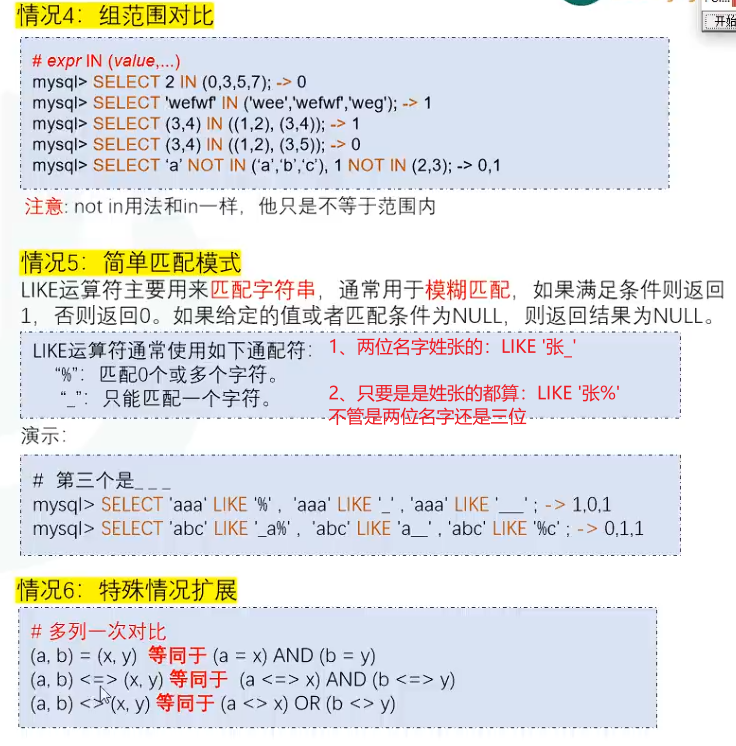

# DQL概述

## 作用

## 分类

# 单表

##  基础SELECT语法

**注意：**

- **`*`通配符必须放在第一位**
- **`NULL`和任何数据做运算，结果都等于NULL(加减乘除)**
  - 解决方法：IFNULL(列名，默认值)
  - 如果该列为空，则变为默认值

> #### 查询常数详解
>
> 

## 显示表结构

## 过滤条件

# 运算符的使用

## 算数运算符

## 比较运算符

> **``非标准`表示只能在MySQL使用，在其他数据库不能使用**

