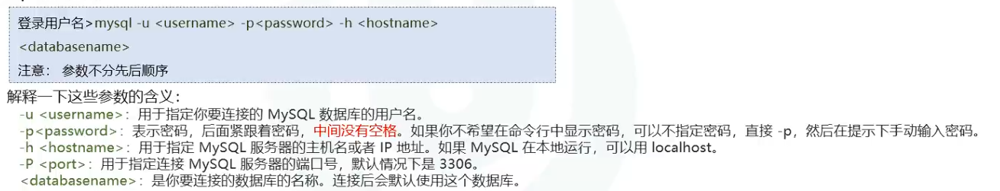
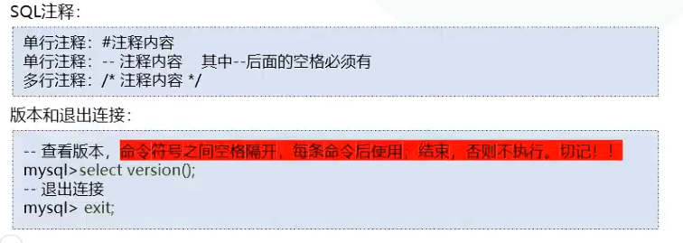

# 本机本地启动

```bash
net start qinjinyan #启动

net stop qinjinyan  #停止
```

# 连接MySQL服务命令



```bash
#本机root
mysql -u root -p @Qjy258879226

#qinjinyan
mysql -u qinjinyan -p @Qjy258879226
```


# 基础SQL命令



# SQL语句分类

## DDL（数据定义）：创建和修改盛放数据的容器

> DDl(Data Definition Language)

## DML（数据操纵）：表中添加、修改、删除数据

## DQL（数据查询）：表中数据多条件查询

## TCL（事务控制）：事务启动、提交、回滚

## DCL（数据控制）：账号创建、权限控制
