# 约束概述

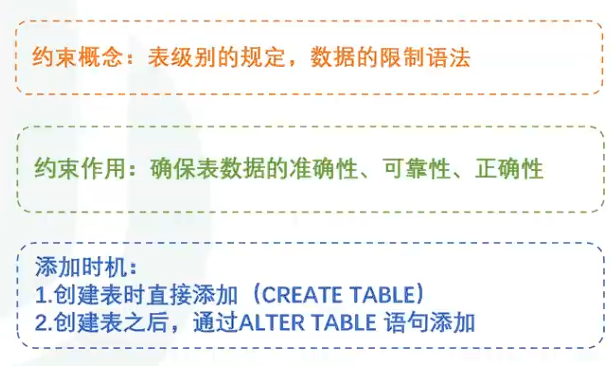

# 约束分类

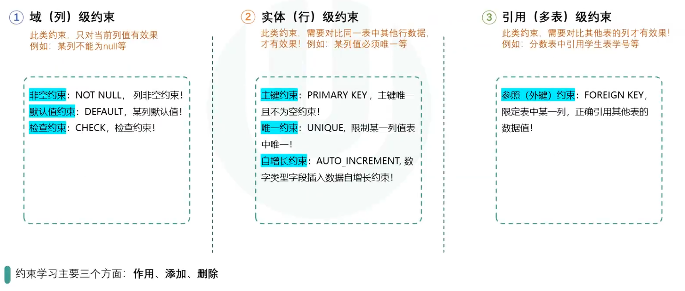

## 域(列)级约束

### 非空约束

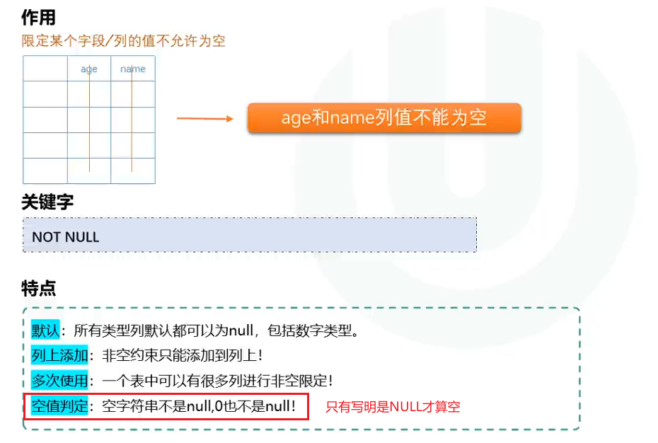

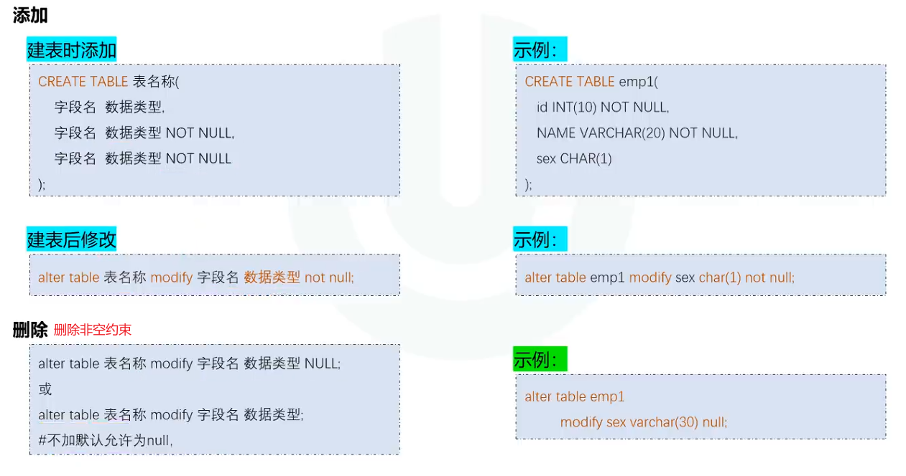

### 默认值约束

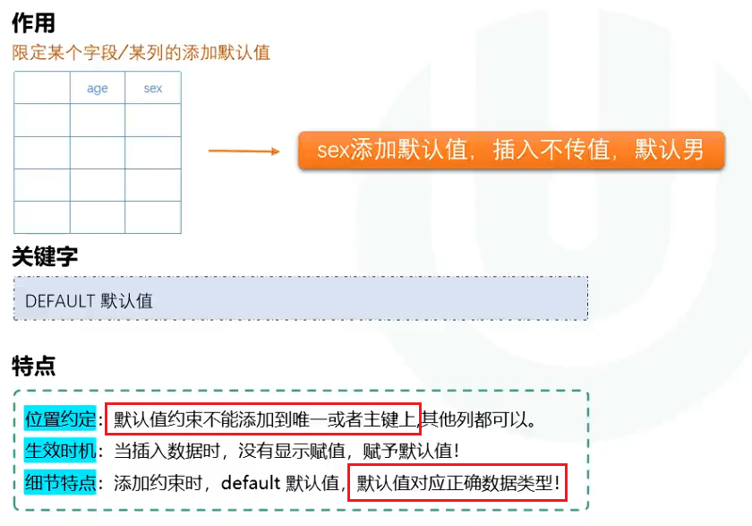

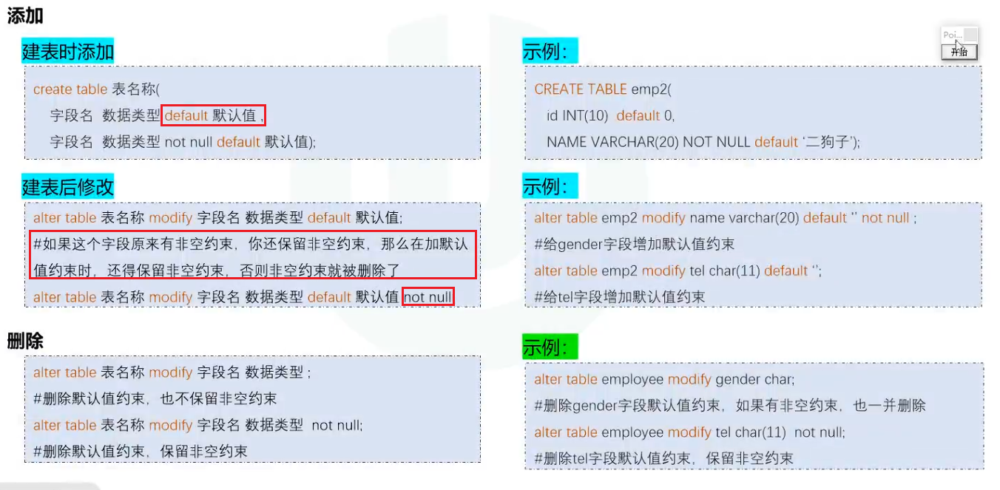

### 检查约束

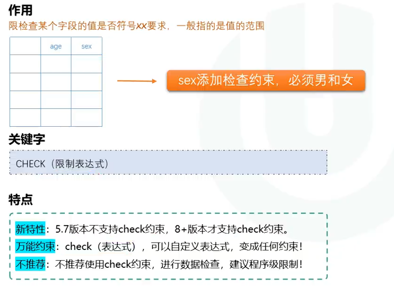

 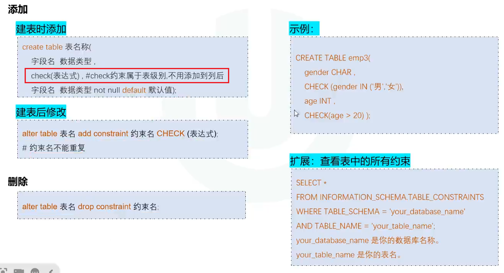


## 实体(行)级约束

### 唯一约束

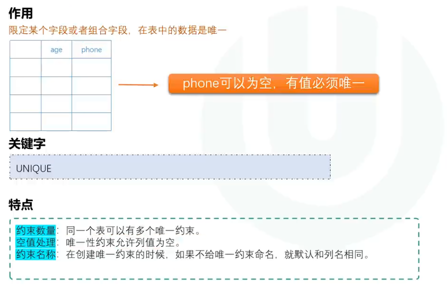

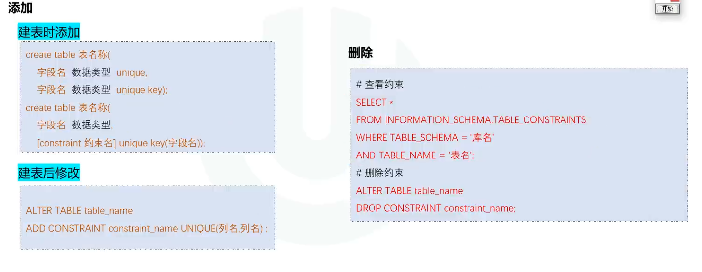

**组合唯一：**

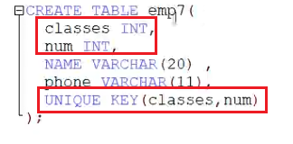

有一行的两列跟另一行重复，就报错，其中一列不一样可以存在


### 主键约束

#### 主键概念

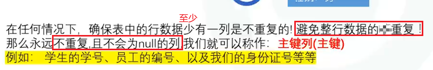

#### 主键分类

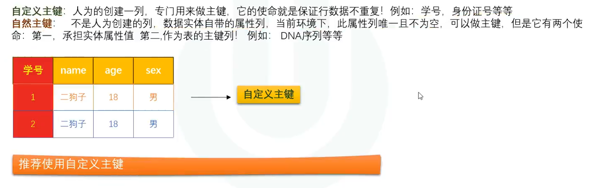

#### 主键细节说明

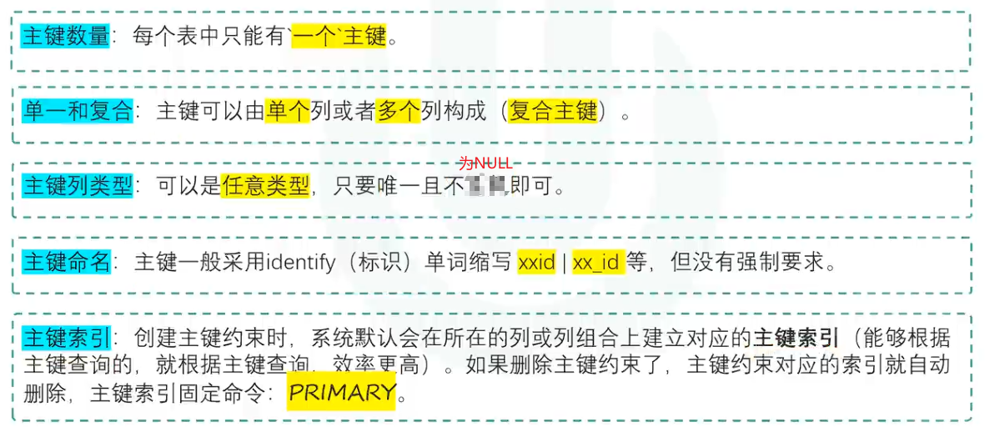

#### 主键约束概念

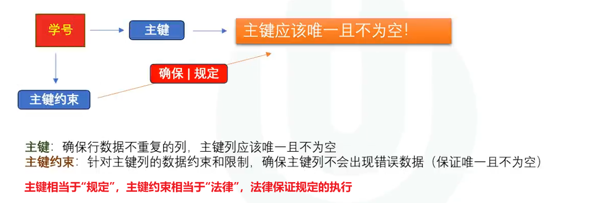

#### 主键约束的使用

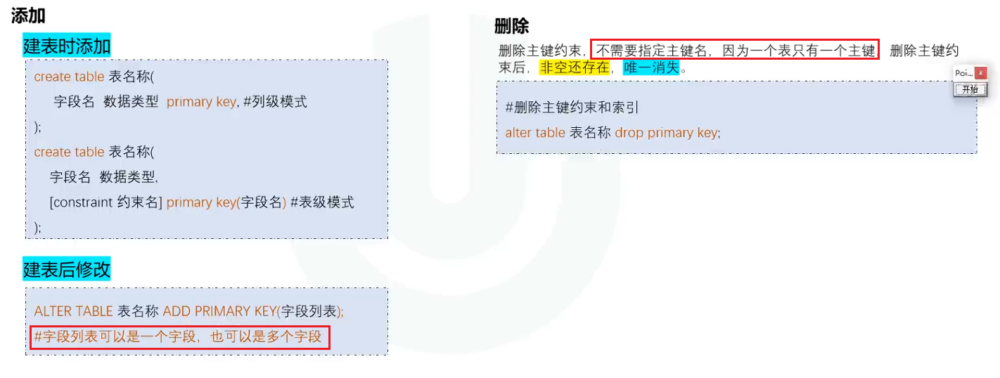

### 自增长约束

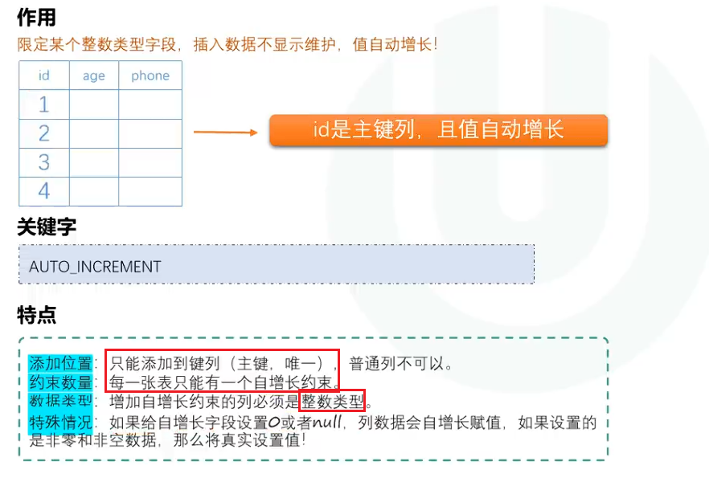

**如果自己插入数据的时候插入了0或NULL，则仍会根据上一行自增长，非0或非空才能插入想要的值**


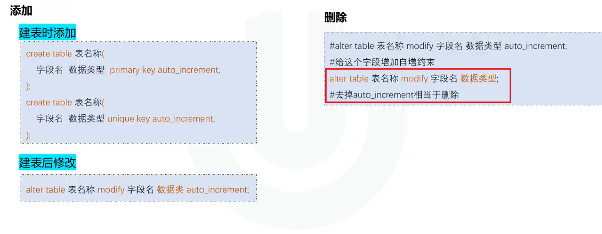

**每次增长只会根据最大值的数据进行增长，即使删除了那一行，MySQL仍会记住最大值**

```mysql
-- 查看当前自增值
SHOW TABLE STATUS LIKE 'user'\G
```

**可以手动更改当前自增的起点**

```mysql
-- 先看看表里实际最大 id
SELECT MAX(id) FROM user;  -- 假设是 3

-- 把自增起点改到 4
ALTER TABLE user AUTO_INCREMENT = 4;
```


## 参照引用(外键)约束

### 概述

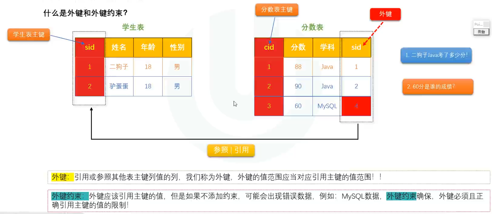


### 细节说明

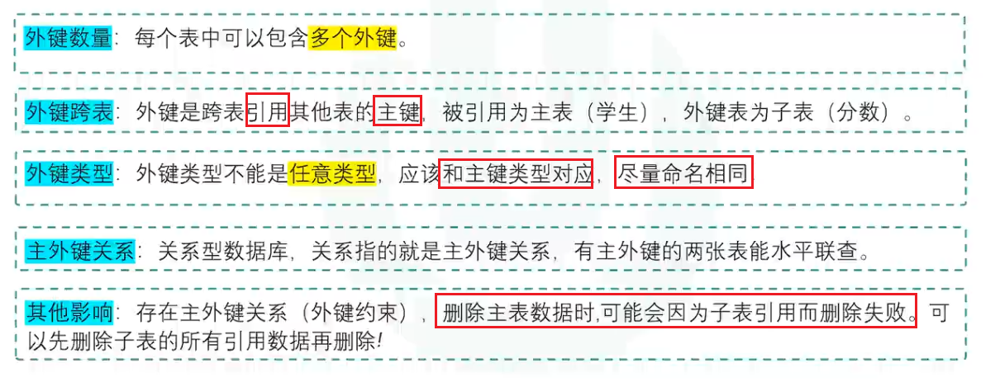

### 使用

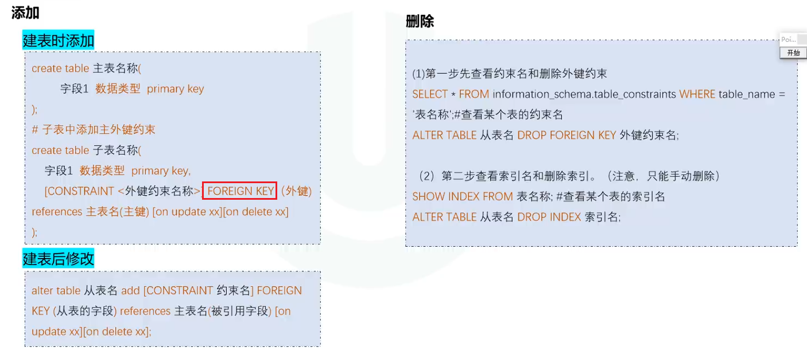


### 级联操作

> 对主表的修改或删除，间接影响子表

- on update 

- on delete

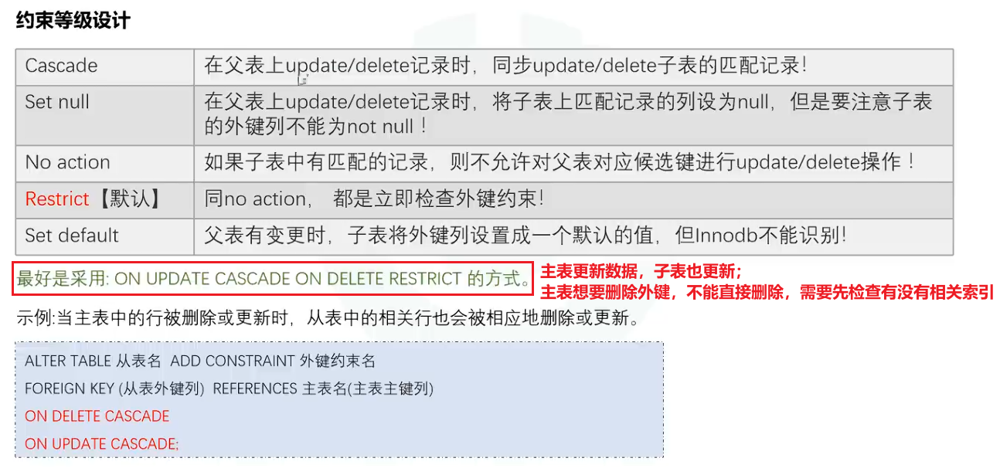


# 约束常见面试题

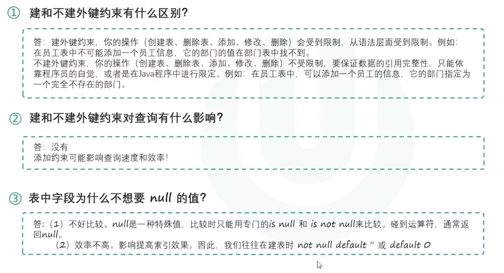

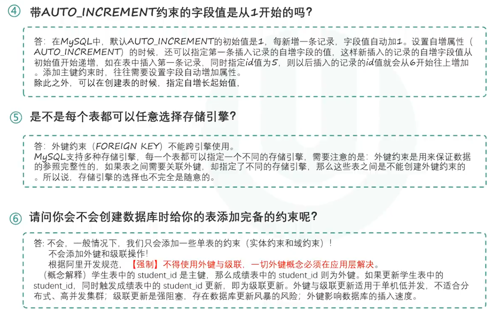
