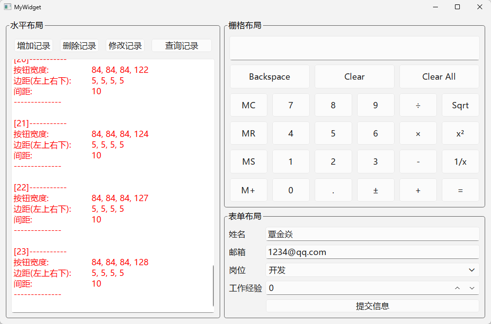

在图形界面开发里，如果控件的位置和大小完全依赖手动坐标，就会有几个明显问题：

- 窗口一旦缩放，界面容易错位。
- 不同系统字体大小不同，控件可能重叠。
- 国际化后文本长度变化，静态坐标很难维护。
- 后期增加控件时，手工调整成本很高。

Qt 的布局管理器就是为了解决这些问题。布局会根据：

- 父窗口尺寸
- 拉伸因子 stretch
- 边距 margins
- 间距 spacing

**自动计算**每个控件应当占据的区域。

# 四种布局

- **水平布局 QHBoxLayout**
  它会把子控件按照从左到右的顺序排布。
  典型场景：顶部工具栏，搜索框和搜索按钮同行展示
- **垂直布局 QVBoxLayout**
  它会把子控件按照从上到下的顺序排布。
  典型场景：页面主内容区，左侧导航栏
- **网格布局 QGridLayout**
  它按照行和列组织控件。
  你可以明确指定一个控件放在第几行、第几列，也可以让它跨多行、多列。
  典型场景：图片宫格，计算器布局，需要同时控制横向和纵向关系的界面
- **表单布局 QFormLayout**
  它是专门为 “标签 + 输入控件” 这种界面设计的。
  它本质上是两列结构：左边通常是字段名，右边通常是输入组件。
  典型场景：注册表单，登录表单，用户资料编辑页

# 实践

**实现效果**



**界面布局**：

拖放控件，完成界面布局：

- 整体采用栅格布局：右侧的 “栅格布局” 占据第0行，“表单布局” 占据第1行，左侧的 “水平布局” 占据两行

- “栅格布局” 中：选中所有控件，将它们的 “Horizontal Policy” 和 “Vertical Policy” 都设置为 “Expanding”

- “表单布局” 中：为`cboRole`添加了三个条目-研发、销售、财务

- 修改textEdit样式表：

  ```css
  QTextEdit {
   color: #0080ce;
  }
  ```


**水平布局参数显示代码实现**：

> mywidget.h
>
> ```cpp
> protected:
>     //事件处理函数，用于响应窗口或控件的大小变化
>     void resizeEvent(QResizeEvent* event) override;
> ```

> mywidget.cpp
>
> ```cpp
> void MyWidget::resizeEvent(QResizeEvent *event)
> {
>     static int index = 1;
> 
>     int linecnt = ui->textEdit->document()->lineCount();
>     if(linecnt > 100*6)
>     {
>         ui->textEdit->clear();
>         index = 1;
>     }
> 
>     //索引
>     QString strIndex = QString("[%1]-----------").arg(index++);
> 
>     //按钮的宽度
>     QString width = QString("按钮宽度: \t\t%1, %2, %3, %4")
>                         .arg(ui->btnAdd->width())
>                         .arg(ui->btnDelete->width())
>                         .arg(ui->btnModify->width())
>                         .arg(ui->btnFind->width());
> 
>     ui->textEdit->append(strIndex);
>     ui->textEdit->append(width);
> 
>     //边距
>     QMargins margins = ui->horizontalwidget->layout()->contentsMargins();
>     QString strMargins = QString("边距(左上右下): \t%1, %2, %3, %4")
>                              .arg(margins.left())
>                              .arg(margins.top())
>                              .arg(margins.right())
>                              .arg(margins.bottom());
> 
>     ui->textEdit->append(strMargins);
> 
>     //间距
>     int spacing = ui->horizontalLayout->layout()->spacing();
>     QString strSpacing = QString("间距: \t\t%1").arg(spacing);
> 
>     ui->textEdit->append(strSpacing);
>     ui->textEdit->append("--------------");
>     ui->textEdit->append("");
> 
>     //移动光标到最后一行
>     ui->textEdit->moveCursor(QTextCursor::End);
> 
> 
> }
> ```
>
> 
