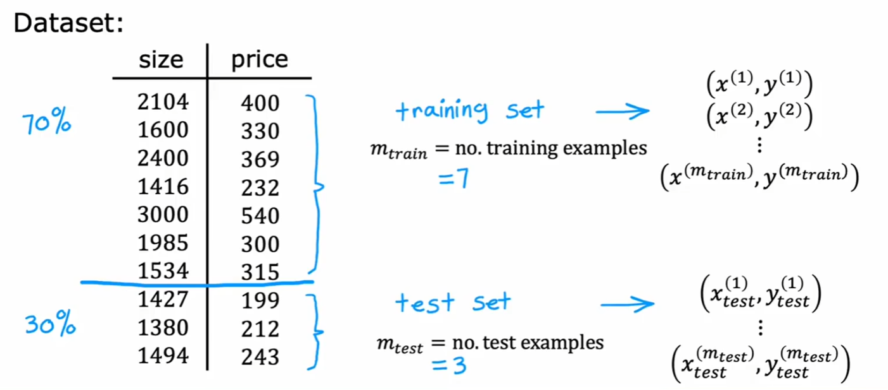
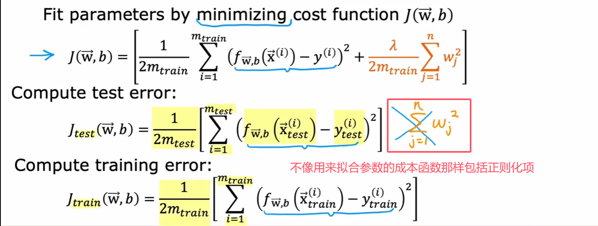
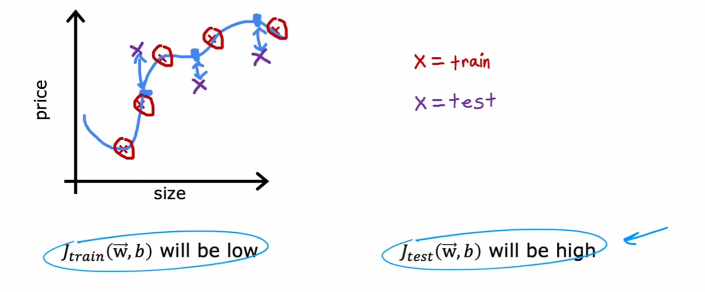
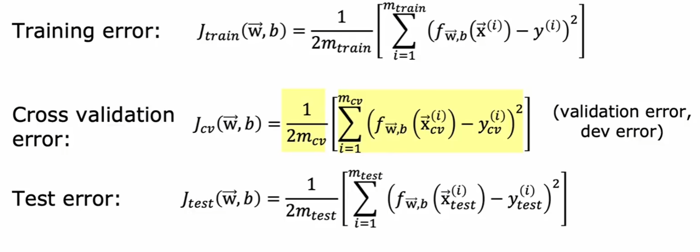
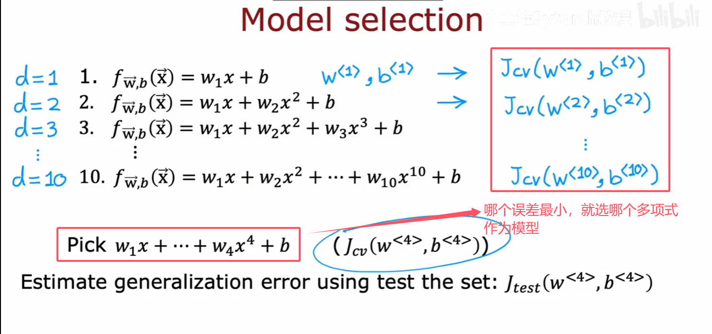
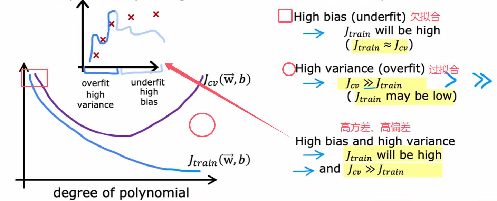
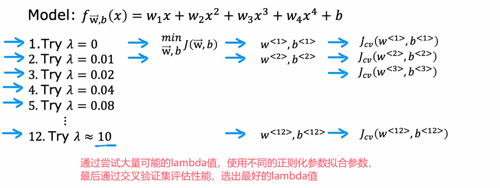
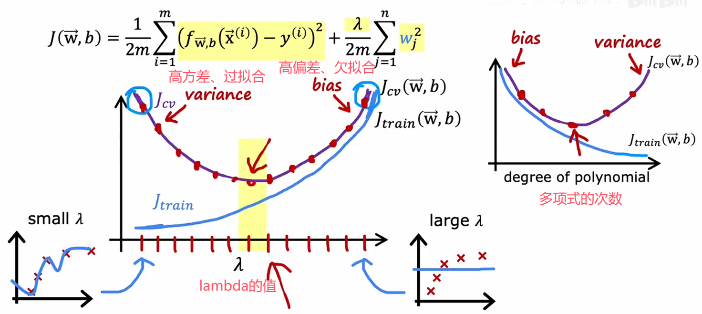

# 监督学习

> 学习**输入输出**或**x到y的映射**，其中学习算法从**正确答案**中学习
>
> 每个示例都与一个输出**标签**y相关联

- 回归(预测房价)

回归试图预测无限多个可能的数字中的任何一个数字

- 分类

分类预测的是一个小的、有限的可能输出类别集合，从一小部分可能的输出中预测一个类别

# 无监督学习

> 数据**没有**与任何输出**标签**y相关联

算法不试图为每个输入提供某种正确答案，相反，要求**算法自己找**出数据中可能有趣或存在的**模式或结构**

- 聚类：自动分组

> 处理无标签的数据并自动将他们分组到不同的簇中

对于特定的数据集，无监督学习算法可能会决定**数据**可以分配到两个**不同的组**或两个**不同的簇**中

例如：

新闻推荐，根据某个你感兴趣的、经常看的词来为你推荐(分组整合并推荐)

典型算法：**K-means 均值聚类**、层次聚类、DBSCAN、高斯混合模型 GMM、均值漂移（Mean Shift）

- 降维：压缩特征

典型算法：**PCA 主成分分析**、因子分析、t-SNE、自编码器、线性判别分析（LDA）、独立成分分析（ICA）

- 异常检测

典型算法：孤立森林（Isolation Forest）、One-Class SVM、局部异常因子（LOF）

- 关联规则挖掘：找规律关系

典型算法：Apriori、FP-Growth（常用于购物篮分析）

- 生成模型

典型算法：生成对抗网络（GAN）、变分自编码器（VAE）、受限玻尔兹曼机（RBM）

# 线性回归

> 线性回归是**最基础、最经典的监督学习回归模型**，核心思想是用**一条直线（或超平面）拟合数据**，用来预测连续型数值。

1. **核心概念**

- **目标**：根据输入特征 x，预测连续输出 y
- **假设**：y 与 x 近似满足**线性关系**
- **应用场景**：房价预测、销售额预测、气温预测、股票趋势等

------

2. **数学表达式**

简单线性回归（单特征）


- y：预测值
- w：权重（斜率）
- b：偏置（截距）

**代价函数**：


------

3. **目标**：

​	线性回归的目标是找到参数w或w和b，使得代价函数j的值尽可能小

------


4. **求解方法**

- 最小二乘法（正规方程）

  直接求解析解，适合小数据集

- 梯度下降法

  迭代优化，适合大数据、高维场景（深度学习常用）

------

5. **特点**

优点

- 简单、可解释性强
- 训练快、计算成本低
- 结果清晰：权重大小代表特征重要性

缺点

- 只能拟合**线性关系**
- 对异常值敏感
- 复杂非线性问题表现差

## 代价函数可视化


# 梯度下降

> 沿着误差减小的方向，一步步调整参数，找到误差最小的点。

在机器学习里：

- 有一个**损失函数 Loss / Cost**，表示模型预测错得多离谱
- 我们要最小化这个 Loss
- **梯度** = Loss 对参数的偏导数，代表 Loss 上升最快的方向
- 所以我们要**往梯度的反方向走**


**α**被称为学习率，一般是小数，作用是**控制下坡时步子的大小**

后面是**成本函数J的导数项**，作用是**决定采取小步的方向**


**导数项的影响：**


**α学习率的影响：**

> 学习率太小，工作效率会很慢，因为采取的步长太小
>
> 学习率太大，步长太大，可能会超过最小值，可能导致无法到达最小值


**w和b的更新：**


**当w更新成w**的时候，即α = 0，说明目前已经在**局部最小值**了，梯度下降不再会改变w


## 常见三种梯度下降

① 批量梯度下降 BGD

- 用**全部训练数据**算梯度
- 稳定、准确，但很慢、耗内存

② 随机梯度下降 SGD

- 每次只用**一个样本**算梯度
- 快，但震荡大、不平稳

③ 小批量梯度下降 Mini-batch GD

- 每次用**一小批数据**（如 32、64、128 条）
- 速度和稳定性平衡，**深度学习最常用**


**总结：**当接近局部最小值的时候，梯度下降会**自动采取更小的步子**。

​	   (因为接近局部最小值的时候，导数自动变小，更新步子也自动变小，即使α保持固定的值)

## 梯度下降的优化

> 梯度下降**优化的是成本函数J(W,B)**,而不是优化激活函数

如果成本函数J(W,B)有很多平坦的地方，梯度更小，会减慢学习速度

## 线性回归的梯度下降


当使用**线性回归的平方误差代价函数**的时候，代价函数**不会有多个局部最小值**，如图，它只有一个单一的全局最小值

只要选择适当的学习率，总是会收敛到全局最小值


**实践操作：**


# 逻辑回归(sigmoid)


## 决策边界

> **逻辑函数**一般指的就是 **sigmoid 函数**，也叫**逻辑斯蒂函数（Logistic Function）**
>
> 它是做**二分类**（是 / 不是、0/1）最经典的**激活函数**


可以通过更**高阶的多项式**将决策边界变得更**复杂**

换句话说，逻辑回归可以学习拟合相当复杂的数据

## Sigmoid激活函数的替代方案


有时候会听到将**线性激活函数**说成"**没有激活函数**"

## 损失函数(loss funtion)

> 对**单个样本**计算的误差


> 越接近1，损失越小：


> 越接近0，损失越小：


> 简化后：


## 成本函数(cost funtion)

> 对**整个训练集所有样本**的**平均误差或总和**


## 逻辑函数的梯度下降

> 更新


# 过拟合

> 如果算法没有很好的拟合训练数据，就说该模型**欠拟合**训练数据(或者说是**高偏差**)


> 但如果很好的拟合了数据，但是又拟合的太好了，看起来不像会对未出现的数据有很好的泛化能力，这就是**过拟合**(或者说是**高方差**)


------


> 同样，过拟合也适用于**分类**


## 解决措施

1. **获取更多的训练数据**
2. 看看是否可以使用更少的特征(减少多项式、特征选择：选择最合适的特征集)
3. 正则化：减小参数的值(通常只减少w~j~参数的大小)

# 深度学习

## 传统机器学习和深度学习的区别

> 简单说：**传统机器学习靠人工设计特征，深度学习靠模型自动学特征**，这是最本质的差异。

- **传统机器学习**：人先手工提取特征（如颜色、边缘、纹理），再喂给模型分类 / 预测。
- **深度学习**：直接喂原始数据（图片、语音、文本），模型**自动学习多层特征**，无需人工设计。

| 对比项     | 传统机器学习                    | 深度学习                              |
| ---------- | ------------------------------- | ------------------------------------- |
| 特征提取   | **人工手动设计**                | 模型**自动学习**                      |
| 数据量需求 | 小 / 中数据即可                 | **需要大量数据**才效果好              |
| 计算资源   | 低，普通电脑就行                | 高，依赖 GPU/TPU                      |
| 模型结构   | 简单（SVM、决策树、逻辑回归等） | 复杂多层网络（CNN、RNN、Transformer） |
| 可解释性   | 较好，能看懂决策逻辑            | 黑盒，**可解释性差**                  |
| 适用场景   | 结构化数据（表格）、小样本任务  | 非结构化数据（图像、语音、自然语言）  |
| 工程难度   | 特征工程工作量大、很关键        | 特征工程少，调参 / 训练成本高         |
| 效果上限   | 中等，靠人工经验天花板明显      | 极高，数据足够时远超传统方法          |

## 神经网络

> 神经网络的结构，核心就是**一层层神经元连接起来，从输入到输出，逐层提取信息**。

一个最标准的神经网络，由三部分组成：

1. **输入层（Input Layer）**

   最开始接收**原始数据**，每个节点对应一个**特征**，不做计算，只负责传递信息

2. **隐藏层（Hidden Layer）**

   负责**特征提取、信息加工**，可以有**一层或多层**（多层就叫深度神经网络 / 深度学习），每层内部有很多**神经元（节点）**，层与层之间**全连接 / 部分连接**

   每一层做两件事：

   1. 加权求和：z=w1x1+w2x2+…+b
   2. 激活函数：把结果 “非线性化”，如 ReLU、Sigmoid、Tanh

3. **输出层（Output Layer）**

   - 给出**最终结果**
   - 节点数量由任务决定：
     - 二分类：1 个节点
     - 多分类：节点数 = 类别数
     - 回归：1 个节点

   常用激活：

   - 分类：Softmax
   - 回归：Linear（不激活）


### 层之间的连接方式

- 全连接层（FC/Dense）

  前一层每个节点都连到后一层所有节点，最基础、最通用

  

- 卷积层（CNN）(卷积神经网络)

  **卷积神经网络**（Convolutional Neural Network，简称 **CNN**），是一种**专门用来处理图像、视频这类网格结构数据**的深度学习神经网络，也是现在**人脸识别、图片分类、自动驾驶、AI 绘画**的核心基础。

  **一、核心特点**

  普通全连接神经网络处理图片时：

  - 把图片像素拉成一长串向量，**参数巨多、容易过拟合、看不出图像特征**。

  CNN 三大核心特性：

  1. **局部感受野**：只看图片一小块区域，不用一次性看整张图
  2. **权值共享**：同一套卷积核（过滤器）整张图复用，**大幅减少参数**
  3. **池化下采样**：压缩图片尺寸，保留关键特征，降低计算量

  **二、CNN 典型层结构（从输入到输出）**

  1. **输入层**：原始图片（比如 224×224×3 彩色图）
  2. 卷积层 Conv：用卷积核提取特征
     - 第一层：提取边缘、线条、角落
     - 中层：提取纹理、形状
     - 高层：提取人脸、物体、整体轮廓
  3. **激活层 ReLU**：引入非线性，让网络能学复杂特征
  4. **池化层 Pooling**：降维、压缩特征，抗轻微位移形变
  5. **全连接层 FC**：把提取好的特征整合
  6. **输出层**：分类（如猫 / 狗 / 飞机概率）

  **三、通俗比喻**

  你可以把 CNN 理解成**层层找特征**：

  - 第一层：像人看东西先看**线条边缘**

  - 第二层：再拼成**纹理、形状**

  - 后面几层：再组合成

    眼睛、脸、整个人

    最后判断这张图是什么。

  **四、常见用途**

  - 图片分类、猫狗识别
  - 人脸识别、人脸打卡
  - 自动驾驶路况识别
  - 医学影像诊断
  - 语义分割、目标检测（YOLO）
  - AI 图像生成、风格迁移

  

- 循环层（RNN/LSTM/GRU）(循环神经网络)

  处理序列数据：文本、语音、时间序列，有记忆能力，能记住前面的信息

  

- Transformer 结构

  目前 NLP 主流，自注意力机制（Self-Attention），能同时关注所有位置的信息

### 工作原理

每一层输入一个数字向量并应用一堆**逻辑回归单元**，然后计算另一个数字变量，

这个向量然后从**一层传递到另一层**，直到得到最终输出层的计算，这是一个神经网络的预测


### 神经元

一个神经元：	

1. 接收上一层输入 x
2. 加权求和：z=wx+b

> z 叫**净输入、加权和、预激活值**

1. 送入

   激活函数

   处理，得到

   激活值 **a**

   

   a=σ(z)

> 核心一句话：
>
> **激活函数：数学变换函数**
>
> **激活值：神经元最终输出的结果**

#### 激活值的计算


可以根据前一层的激活值计算任何层的激活值

g在这里是Sigmoid函数，在神经网络的上下文中，g也称为激活

## 前向传播


**从输入层到第一层隐藏层，中间有25个神经元**


**第二层隐藏层有15个神经元**


**输出层只有一个神经元**


### 全连接神经网络的前向传播

**代码实现**


**一、整体网络结构**

这是一个**2 层全连接网络**：

- **输入层**：2 维特征向量 `x`（比如图里的 `[200, 17]`）

- **第 1 隐藏层（layer1）**：3 个神经元

- 第 2 层（layer2）：1 个神经元（输出层）

  数据流向：`x → a1（隐藏层输出） → a2（最终输出）`

------

**二、第 1 步：计算第 1 隐藏层（layer1）**

图里把 3 个神经元的计算都拆解开了：

1. **输入与参数**

- 输入向量：`x = np.array([200, 17])`

- 3 个神经元的权重和偏置：

  | 神经元  |   权重向量 `w`   |   偏置 `b`    |
  | :-----: | :--------------: | :-----------: |
  | 第 1 个 | `w1_1 = [1, 2]`  | `b1_1 = [-1]` |
  | 第 2 个 | `w1_2 = [-3, 4]` | `b1_2 = [1]`  |
  | 第 3 个 | `w1_3 = [5, -6]` | `b1_3 = [2]`  |

2. **每个神经元的计算**

每个神经元都遵循公式：

aj[1]=g(wj[1]⋅x+bj[1])

这里的 `g` 是 `sigmoid` 激活函数。

- 第 1 个神经元：

  ```py
  z1_1 = np.dot(w1_1, x) + b1_1  # = [1,2]·[200,17] + (-1) = 1*200 + 2*17 -1 = 233
  a1_1 = sigmoid(z1_1)           # 对233做sigmoid，结果接近1
  ```

- 第 2 个神经元：

  ```py
  z1_2 = np.dot(w1_2, x) + b1_2  # = [-3,4]·[200,17] + 1 = -3*200 +4*17 +1 = -531
  a1_2 = sigmoid(z1_2)           # 对-531做sigmoid，结果接近0
  ```

- 第 3 个神经元：

  ```py
  z1_3 = np.dot(w1_3, x) + b1_3  # = [5,-6]·[200,17] + 2 = 5*200 -6*17 +2 = 800
  a1_3 = sigmoid(z1_3)           # 对800做sigmoid，结果接近1
  ```

3. **隐藏层输出**

把 3 个神经元的输出拼起来，得到第 1 层的输出向量 `a1`：

```py
a1 = np.array([a1_1, a1_2, a1_3])
```

这个 `a1` 就是下一层的输入。

------

**三、第 2 步：计算第 2 层（输出层）**

输出层只有 1 个神经元，计算逻辑和隐藏层完全一样：

1. **参数定义**

- 权重向量：`w2_1 = np.array([-7, 8, 9])`（长度为 3，和 `a1` 的维度匹配）
- 偏置：`b2_1 = np.array([3])`

2. **计算过程**

```py
z2_1 = np.dot(w2_1, a1) + b2_1   # 线性部分
a2_1 = sigmoid(z2_1)             # 激活函数，得到最终输出
```

这个 `a2_1` 就是整个网络的预测结果，和你第一张图里的 `a[3]` 对应。

### 手动实现神经网络前向传播


**一、左侧：单个全连接层的数学定义**

这部分展示了一个**输入维度为 2、输出维度为 3**的全连接层，把矩阵、向量和公式对应了起来：

1. **输入与参数定义**

   - 输入向量：`a_in = np.array([-2, 4])`，也就是网络的输入 x=a[0]

   - 权重矩阵 W：

     ```
     W = np.array([
         [1, -3, 5],
         [2, 4, -6]
     ])
     ```

     它的形状是 `2×3`，每一列对应一个神经元的权重向量：

     - 第 1 列：w1[1]=[1,2]T
     - 第 2 列：w2[1]=[−3,4]T
     - 第 3 列：w3[1]=[5,−6]T

   - 偏置向量 b：`b = np.array([-1, 1, 2])`，每个元素对应一个神经元的偏置：b1[1]=−1,b2[1]=1,b3[1]=2

2. **单个神经元的计算逻辑**

   每个神经元的计算都遵循公式：

   zj=wj⋅ain+bj

   aj=g(zj)

   其中 g() 是激活函数（比如 sigmoid、ReLU 等），图中单独说明它是在外部定义的。

------

**二、中间：`dense` 函数的实现**

这是用 NumPy 写的**单个全连接层的前向传播函数**，逐行解析：

```py
def dense(a_in, W, b):
    units = W.shape[1]      	# 获取输出层的神经元数量（这里是3）
    a_out = np.zeros(units) 	# 初始化输出向量，形状为(3,)
    for j in range(units):	 	# 遍历每个神经元（j=0,1,2）
        w = W[:,j]         		# 取出第j个神经元的权重向量
        z = np.dot(w, a_in) + b[j] # 计算线性部分 z = w·a_in + b_j
        a_out[j] = g(z)    		# 应用激活函数，得到第j个神经元的输出
    return a_out
```

- 这个函数把左侧的数学公式直接翻译成了代码，是理解全连接层的 “原子级” 实现。

- 比如对 

  a_in = [-2,4]、W和 b，计算第 1 个神经元：z1=[1,2]⋅[−2,4]+(−1)=1∗(−2)+2∗4−1=−2+8−1=5

  再经过 g(5) 得到 a1。

------

**三、右侧：多层网络的串联**

这部分展示了如何把多个 `dense` 层串起来，实现完整的前向传播：

```py
def sequential(x):
    a1 = dense(x, W1, b1)  # 第1层：输入x，输出a1
    a2 = dense(a1, W2, b2) # 第2层：输入a1，输出a2
    a3 = dense(a2, W3, b3) # 第3层：输入a2，输出a3
    a4 = dense(a3, W4, b4) # 第4层：输入a3，输出a4
    f_x = a4
    return f_x
```

- 这就是 “前向传播” 的核心逻辑：**每一层的输出，都是下一层的输入**，数据从输入层一路流向输出层。
- 它和你上一张图里的 Keras `Sequential` 模型本质上是一样的，只是这里用 NumPy 手动实现了，而不是调用高级 API。

## 代码中的推理

> 使用TensorFlow在代码中实现推理

- 优化烘培咖啡


在开始前得先加载TensorFlow库、加载神经网络参数w和b

```python
x = np.array([[200.0,17.0]]) #使用NumPy来创建一个特征数组，200摄氏度,17分钟，两个中括号是为了表示它是一个二维数组(矩阵)
layer_1 = Dense(units = 3,activation = 'sigmoid') #Dense密集层,units = 3三个隐藏层，使用Sigmoid函数作为激活函数
a1 = layer_1(x)
```

```python
layer_2 = Dense(units = 1,activation = 'sigmoid')
a2 = layer_2(a1)
```


```python
if a2 >= 0.5:
	yhat = 1
else:
	yhat = 0
```

- 其他例子


- 数据处理


1. 如果在NumPy中**加载和操作数据**，将NumPy数组传递给TensorFlow时，TensorFlow喜欢将其转换为自己的内部格式——**张量**，然后使用张量高效地进行操作
2. 当**读取数据**时，可以保持它为张量或将其转换回NumPy数组

## 构建神经网络


**一、左侧：神经网络结构示意图**

这是一个典型的**前馈全连接网络**，结构清晰标注了各层的单元数和数据流向：

1. **输入层**：向量 x，它会被送入第一层隐藏层。
2. **第 1 层隐藏层（layer_1）**：包含 **25 个神经元（units=25）**，输出为激活后的向量 a[1]。
3. **第 2 层隐藏层（layer_2）**：包含 **15 个神经元（units=15）**，接收上一层的输出 a[1]，计算后输出向量 a[2]。
4. **输出层（layer_3）**：包含 **1 个神经元（units=1）**，接收 a[2]，最终输出 a[3]。

> 注：图中所有层的激活函数，在代码里统一设置为`sigmoid`，这是一个将输出压缩到`[0,1]`区间的函数，非常适合二分类任务。

------

**二、右侧：Keras 实现代码解析**

这是用 TensorFlow/Keras 构建、训练和使用这个网络的完整代码示例，我们逐段拆解：

1. **定义网络层**

```python
layer_1 = Dense(units=25, activation="sigmoid")
layer_2 = Dense(units=15, activation="sigmoid")
layer_3 = Dense(units=1, activation="sigmoid")
```

- `Dense`：全连接层（也叫稠密层），是神经网络的基础层。
- `units=N`：指定该层的神经元数量，和左侧结构图的单元数一一对应。
- `activation="sigmoid"`：指定激活函数，所有层都使用了 sigmoid。

2. **搭建 Sequential 模型**

```python
model = Sequential([layer_1, layer_2, layer_3])
```

- `Sequential` 是 Keras 中最简单的模型类型，用于构建**线性堆叠的层**，数据会按顺序从第一层流向最后一层。

3. **编译模型**

```python
model.compile(...)
```

- 这一步需要指定优化器、损失函数和评估指标，比如二分类任务常用的`binary_crossentropy`损失函数、`adam`优化器和`accuracy`指标。

4. **准备训练数据**

```python
x = np.array([[0..., 245, ..., 17],
              [0..., 200, ..., 184]])
y = np.array([1,0])
```

- `x` 是输入特征矩阵，每一行是一个样本的特征向量（比如图中是 2 个样本）。
- `y` 是标签，这里是二分类的标签（1 和 0），和输出层的 1 个神经元对应。

5. **训练模型**

```python
model.fit(x,y)
```

- 用准备好的`x`和`y`数据，让模型学习特征和标签之间的映射关系。

6. **预测新数据**

```python
model.predict(x_new)
```

- 训练完成后，用`predict`方法对新的样本`x_new`进行预测，输出每个样本的预测结果（因为用了 sigmoid，结果会是 0~1 之间的概率值）。

# 矩阵乘法

> **前行**乘**后列**
>
> 乘的条件是**前列 = 后行**
>
> 转置的目的是用「**A 的列向量转置成行向量，再和 W 的列向量做点乘**」的方式，来演示矩阵乘法的本质逻辑。


**代码实现**


# 激活函数

> **为什么要有激活函数？**
>
> 没有激活函数，再多层神经网络也只是等价于单层线性回归，无法拟合复杂非线性问题；
>
> 激活函数引入非线性，让深层网络有表达能力。


## 输出层

> 在考虑输出层的激活函数时，通常会根据**目标或真实标签**Y有一个自然的选择，例如：如果处理一个二分类问题，那么Sigmoid激活函数几乎总是最自然的选择


## 隐藏层

> 在隐藏层，**ReLU激活函数**已经成为最常见的选择

# Softmax回归

> softmax回归就相当于**多分类**版的逻辑回归
>
> 逻辑回归（Sigmoid）做**二分类**，Softmax 回归做**多分类**，输出每个类别的**概率**，总和为 1。


**softmax公式**：

## 成本函数


## 带有softmax输出的神经网络


**更准确的版本**


# 模型评估

## 训练集 + 测试集

**适用场景：**

1. **数据量大**（上万 / 十万级），随机切 7:3 或 8:2 足够稳定。
2. **不做超参数搜索**（模型结构 / 参数已定，直接训练）。
3. **快速验证 baseline**，只想看模型泛化能力，不调优。

**做法：**

- 训练集（70%~80%）：训练模型。
- 测试集（20%~30%）：**只在最后用一次**，评估最终性能。





### **线性回归(采用平方误差代价)的训练、测试流程**





**high表示误差大**


## 训练集 + 验证集（交叉验证、开发集、dev集） + 测试集

**适用场景：**

1. **数据量小**（几千或更少），切分后子集太小，不稳定。
2. **需要大量调参 / 选模型**（如选网络层数、学习率、正则项）。
3. **防止过拟合**：用验证集 “监控” 训练，早停、选最优模型。

**做法：**

- 训练集（60%~70%）：训练不同超参数的模型。
- 验证集（15%~20%）：**反复用**，调参、选模型、早停。
- 测试集（15%~20%）：**最后用一次**，给出无偏的最终结果。

**通过训练集和验证集来选出最好的模型，只有在确定了最终模型之后才在测试集上评估它**

**交叉验证（常用 K 折）：**

- 把训练集分成 K 份，轮流用 1 份当验证、剩下当训练。
- 适合数据少、想充分利用数据、结果更稳。


### **选择更好模型的方法**





# 诊断偏差与方差

> **偏差是 “准不准”，方差是 “稳不稳”**，二者共同决定模型泛化能力，核心是**偏差 - 方差权衡**。

## 偏差

**定义**：模型**平均预测值**和**真实值**之间的差距，反映模型**拟合能力强弱**。

- 高偏差（欠拟合）：模型太简单（如用线性模型拟合非线性数据），

  学不到数据规律，训练集、测试集误差都大。

  - 例子：用直线拟合 “曲线分布” 的数据，所有预测都偏离真实值。

- **低偏差（拟合好）**：模型足够复杂，**能捕捉数据规律**，训练集误差小。

## 方差

**定义**：用**不同训练数据**训练出的模型，**预测结果的波动程度**，反映模型**对数据噪声的敏感程度**。

- 高方差（过拟合）：模型太复杂（如深度神经网络、高阶多项式），

  过度记住训练集噪声，训练集误差极小、测试集误差极大。

  - 例子：模型把训练集的 “随机误差” 当成规律，换数据预测就乱。

- **低方差（稳定）**：模型简单，**对噪声不敏感**，不同数据训练出的模型结果差不多。

------

**低偏差 + 低方差（理想）**：所有点都集中在靶心，**准且稳，模型泛化能力最强。**

**低偏差 + 高方差（过拟合）**：点都在靶心附近，但**散得很开**，准但不稳。

**高偏差 + 低方差（欠拟合）**：点集中在**远离靶心的区域**，稳但不准。

**高偏差 + 高方差（最差）**：点又偏又散，**不准也不稳**。




## 正则化

**如何选择一个好的lambda值？**

以四阶多项式为例：

使用交叉验证来为正则化参数lambda做出一个好的选择






