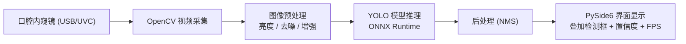

# 基于口腔内窥镜的实时口腔龋病AI系统 —— 纯 Python 版路线图

> 面向基础较薄弱的计算机专业学生，把原 C++ 路线图整体换成 Python 技术栈，按"先跑通、再完善"的原则，从零到一完成一个可演示的实时龋病检测系统。

## 0. 项目定位与总体思路

**一句话目标**：用口腔内窥镜（USB 摄像头）采集实时画面，AI 模型识别画面中的龋齿区域，在屏幕上叠加检测框，实现"实时辅助筛查"。

**技术栈（全部 Python）**：

| 职责 | 用什么 |
| --- | --- |
| 视频采集、图像处理 | OpenCV-Python（cv2）+ numpy |
| 数据标注与整理 | LabelImg / Roboflow + 自写 Python 脚本 |
| 模型训练 | PyTorch + Ultralytics YOLOv8 |
| 模型推理 | ONNX Runtime（Python 接口） |
| 界面与多线程 | PySide6 / PyQt6 + QThread |
| 打包发布 | PyInstaller |

> 一点澄清：OpenCV、ONNX Runtime 这些库底层是 C++ 写的，Python 只是接口，所以纯 Python 方案的性能并不差，只是你不需要自己写 C++。

**目标平台与硬件**：
- Windows 桌面系统；
- USB 口腔内窥镜（一般免驱 UVC 协议，即插即用）；
- 训练需要 NVIDIA 显卡（没有可用 Google Colab 免费 GPU）；
- 部署推理在普通 CPU 上也能跑（用小模型）。

**重要边界**：本项目是学习/科研演示系统，AI 结果不能替代医生诊断，界面和文档里都要注明。

**与 C++ 版的关系**：两者代码结构完全同构（采集 → 预处理 → 推理 → 后处理 → 显示）。以后如果想迁移到 C++，按模块逐个移植即可，架构设计不用改。

## 1. 系统总体架构

数据流：摄像头采集一帧 → 预处理 → 模型推理 → 后处理过滤重叠框 → 界面显示。三个线程分工：采集线程、推理线程、UI 线程。

## 2. 分阶段路线图（约 5~6 个月，每周 10~15 小时）

### 阶段 0：Python 基础准备（第 1~2 周）

**目标**：搭好环境，能写能运行 Python 程序。

- 学习：Python 基础——变量、函数、类、列表/字典；numpy 数组基础；Git 基础。
- 工具：Anaconda 或 Miniconda 建虚拟环境、VS Code、Git + GitHub。
- 任务：装好 `opencv-python` 和 `numpy`，写一个程序读取一张图片并显示窗口。
- **里程碑**：一个能显示图片的 OpenCV-Python 小程序。

> 基础弱不用啃完一本书，先掌握"够用子集"，边做项目边补。用虚拟环境管理依赖，避免装坏系统 Python。

### 阶段 1：实时图像采集与显示（第 3~4 周）

**目标**：内窥镜画面实时流畅显示。

- 学习：`cv2.VideoCapture`、numpy 数组、显示循环、FPS 计算。
- 任务：接入内窥镜；设置分辨率（如 1280×720）；实时显示；截图保存。
- **里程碑**：FPS ≥ 25 的实时画面，能保存截图。

> 坑：大多数 USB 内窥镜是 UVC 免驱；少数需要厂商 SDK 或驱动，购买前先确认。

### 阶段 2：数据准备与图像预处理（第 5~7 周）

**目标**：拥有一套质量合格的标注数据集，并有可复现的预处理脚本。

- 学习：目标检测标注概念、YOLO 标注格式、数据增强。
- 任务：
  - 收集公开数据集（如 STO-REC、Bode、Kaggle 上的口腔龋齿数据集），也可自拍标本/口腔照片补充；
  - 用 LabelImg 或 Roboflow 标注龋齿（YOLO 格式），用脚本划分 train/val/test；
  - 预处理实验：光照校正（口腔内光线差）、CLAHE 对比度增强、去噪、白平衡，写成可复用的 Python 函数。
- **里程碑**：≥ 500 张标注数据（越多越好），预处理模块跑通并能批处理。

> 数据质量决定模型上限：宁可少而准，不要多而错。

### 阶段 3：模型训练（第 8~14 周）

**目标**：训练出能检测龋齿的 YOLO 模型，并导出 ONNX。

- 学习：CNN 与目标检测原理（YOLO 是怎么工作的）、PyTorch / Ultralytics 基本用法、评估指标。
- 任务：
  - 用 Ultralytics 训练 `yolov8n`（先拿最轻量模型跑通全流程）；
  - 调 epochs、imgsz、数据增强、学习率；
  - 评估 mAP@0.5、precision/recall，分析漏检错检样本；
  - 导出 `model.onnx`。
- **里程碑**：验证集 mAP@0.5 达到可接受水平（数据质量正常时目标 ≥ 0.6），得到 ONNX 模型。

> 显卡不够就用 Google Colab（免费 T4）。效果不好时，优先补数据、改标注，而不是换更大的模型。

### 阶段 4：模型推理模块（第 15~17 周）

**目标**：Python 程序能加载模型并对图片输出检测框。

- 学习：ONNX Runtime Python API、图像 resize/归一化（letterbox）、NMS 后处理。
- 任务：写一个 `Detector` 类——输入 numpy 图像（一帧），输出检测框 + 类别 + 置信度；先对单张图片和视频文件测试。
- **里程碑**：单帧推理延迟达标——CPU < 100ms，GPU < 30ms。

> 不建议直接用 `ultralytics` 的预测接口，那会把工程细节藏起来；手写预处理 + NMS 才能真正理解推理链路，面试也更有料。

### 阶段 5：实时系统整合与 GUI（第 18~21 周）

**目标**：端到端实时检测可稳定运行。

- 学习：PySide6 基础（信号槽、控件布局）、QThread 多线程（采集 / 推理 / UI 分离）、队列传帧。
- 任务：界面显示实时画面 + 检测框 + 置信度 + FPS；支持暂停、截图、录像、开始/停止。
- **里程碑**：稳定 FPS ≥ 20，不卡顿、不闪退。

> 千万别把推理放进 UI 线程，否则画面必卡；用 `queue.Queue` 或 `QMutex` 做帧缓冲，把采集、推理、显示解耦。

### 阶段 6：优化、测试与交付（第 22~24 周）

**目标**：从"能跑"到"能演示、能交作业/答辩"。

- 优化：推理延迟、内存占用、画面卡顿；处理多颗牙、光线变化、牙面反光、过近过远等边界情况。
- 测试与文档：用 pytest 给预处理、后处理、Detector 写单元测试；写 README 和架构说明。
- 交付：用 PyInstaller 打包成 exe（注意隐藏导入和模型文件路径问题）、录制演示视频、结题报告 + 答辩 PPT。
- **里程碑**：完整可演示系统 + 完整文档。

## 3. 验收清单速览

| 阶段 | 核心技能 | 交付物 | 时间 |
| --- | --- | --- | --- |
| 0 基础 | Python 子集、numpy、环境 | 能显示图片的小程序 | 2 周 |
| 1 采集 | OpenCV VideoCapture | 内窥镜实时画面 + 截图 | 2 周 |
| 2 数据 | 标注、预处理脚本 | ≥500 张标注数据 + 预处理模块 | 3 周 |
| 3 训练 | YOLO、PyTorch | 达标的 ONNX 模型 | 7 周 |
| 4 推理 | ONNX Runtime、NMS | 单张图片检测的 Detector 类 | 3 周 |
| 5 整合 | PySide6、QThread | 端到端实时 Demo | 4 周 |
| 6 交付 | pytest、PyInstaller | 安装包 + 演示 + 报告 | 3 周 |

## 4. 推荐学习资源

- Python：《Python编程：从入门到实践》前半部分；廖雪峰 Python 教程
- numpy：官方 Quickstart 教程（只学数组、切片、布尔索引就够）
- Git：廖雪峰 Git 教程
- OpenCV-Python：官方教程 + B 站入门视频
- 深度学习：吴恩达《深度学习》课程前几周；Ultralytics 官方文档（跟着做一遍 YOLO 训练教程）
- ONNX Runtime：官方 Python API 文档
- PySide6：官方文档 + B 站入门教程

## 5. 避坑建议（重点）

1. **先跑通最小系统**：不要一上来追求完美，先做出"采集 → 推理 → 显示"的整条链路，再逐步加功能。
2. **推理链路的细节自己写**：手写 letterbox 预处理和 NMS，不要全用现成黑盒，面试才能讲清楚。
3. **数据比模型重要**：把最多的时间花在数据收集、清洗、标注上。
4. **多线程注意 GIL**：采集、推理、显示拆成三个 QThread，帧与帧之间用队列传递，避免在 UI 线程里做重活。
5. **性能优化从"少拷贝"开始**：全程保持 BGR/numpy 表示，避免每帧重复 `cvtColor` 和无谓的深拷贝。
6. **PyInstaller 尽早试**：不要最后一周才打包，模型路径、`--hidden-import`、OpenCV 动态库这些坑要提前踩。
7. **标注医学边界**：界面和文档注明"辅助筛查，非诊断用途"。
8. **每周写周记**：记录进度、卡点、学到的内容，既能防止拖延，也是答辩素材。

## 6. 可选扩展方向（做完主线后再考虑）

- 多类别检测：浅龋 / 中龋 / 深龋、牙位编号；
- 病灶分割：YOLO-seg 或 SAM 输出龋坏区域轮廓；
- 边缘设备部署：Jetson / 树莓派（Python 也可跑）；
- 病历存档：SQLite 保存检查记录与历史对比；
- 迁移到 C++：核心模块逐个移植，投 C++ 软件岗时可用。

## 7. 时间紧张时的取舍

- 最低可交付版本：阶段 0→1→3（用现成训练脚本）→4→5，跳过打包和深度优化；
- 优先级：数据（2）和训练（3）决定项目上限，推理（4）与整合（5）决定能否演示；
- 如果时间不够，阶段 6 的打包可以砍掉，但"演示视频 + 报告"建议保留。

## 8. 纯 Python 版的定位提醒

纯 Python 项目在简历上更偏"AI 算法 / 图像处理"方向，投算法岗、图像岗没问题；但投 C++ 软件岗会被问"能不能用 C++ 重写"。如果目标是深圳医疗影像公司的 C++ 岗位，建议把"采集 + 推理 + 显示"主线迁移成 C++，模型训练保持 Python 不变。
