# 定义

对问题求解时，总是做出在**当前**看来是**最好的选择**，不从整体最优上加以考虑，所做出的仅是在**某种意义上**的**局部最优解**


通常**希望找到整体最优解**，所以采用贪心法时，需要**证明**设计的算法确实是**整体最优解**或**求解了它要解决的问题**


每一次贪心选择都将所求的问题**简化**为**规模更小的子问题**，并期望通过每次所做的**局部最优**选择产生出一个**全局最优解**

# 性质

## 贪心选择性质

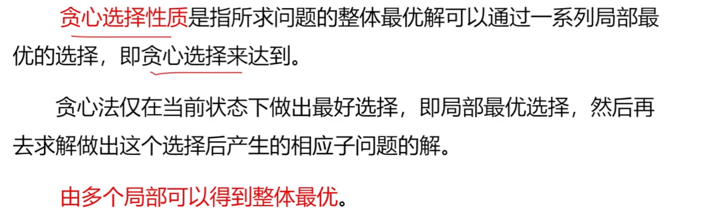

## 最优子结构性质 

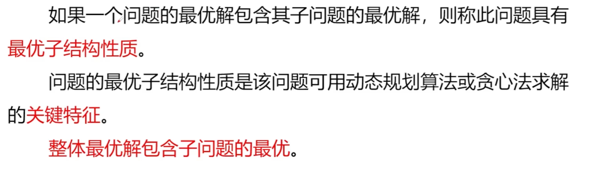

# 求解过程

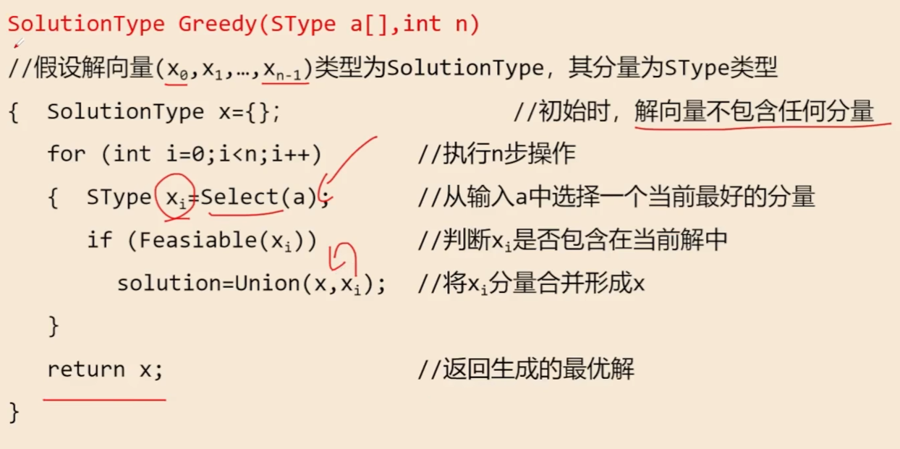


# 证明：贪心解不劣于最优解

方法 ：**交换论证**（最常用，首选）

**核心思想**

假设存在一个**最优解 O**，和贪心解 G 不一致。**逐步交换** O 中与贪心选择冲突的元素，每次交换后：

1. 解仍然合法；
2. 解的总价值 / 代价不会变差；最终把最优解 O完全转换成贪心解 G，由此证明：val(G)≥val(O)

**通用步骤**

1. 假设 O 是任意一个最优解，G 是贪心解，二者不完全相同。
2. 找到**第一个**贪心做出选择、但最优解没选的位置 / 元素。
3. 将 O 中对应元素**替换为贪心选择**，得到新解 O′。
4. 证明：O′ 合法，且 val(O′)≥val(O)（新解不比原最优解差）。
5. 重复交换，直到 O 变成 G，得证 val(G)≥val(O)。

# 活动安排问题

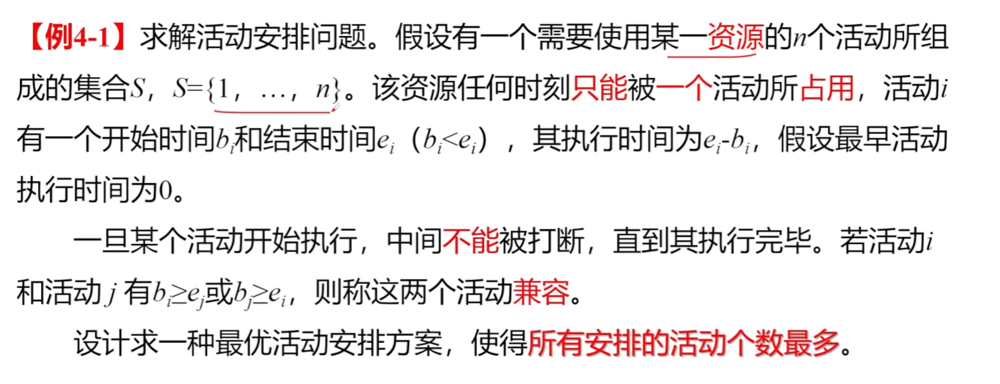

**求解：**

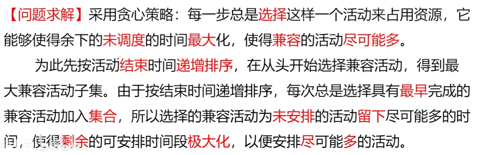

**例题：**

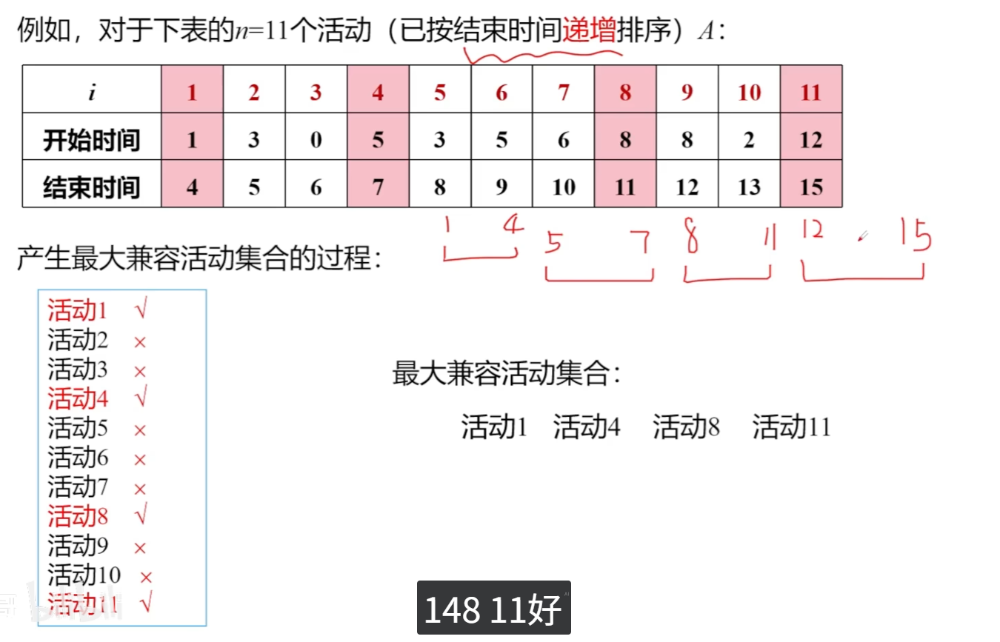

**代码：**

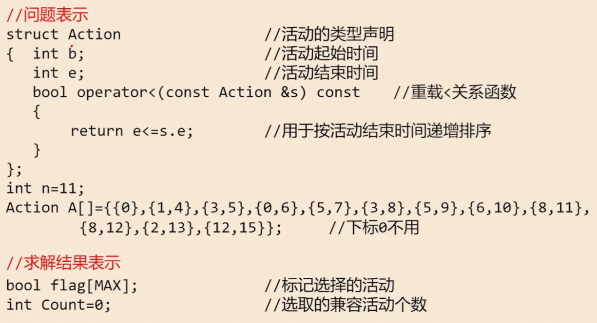

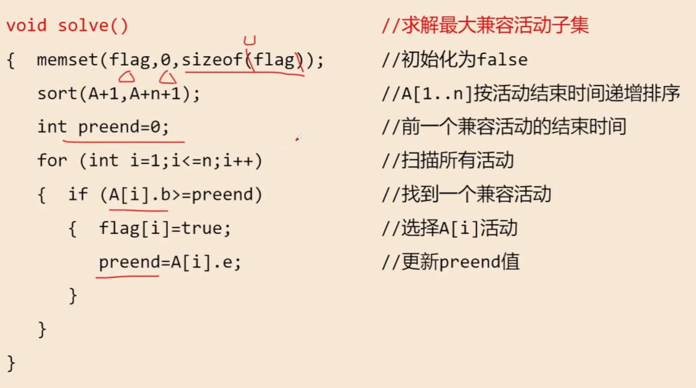

整个算法的**时间复杂度**为O(nlogn)


# 背包问题

## 整个装入

> 给定N个物品和一个背包，背包的容量为W， 假设**背包容量**范围在[0，15]，第i个物品对应的**体积**和**价值**分别为**W[i]**和**v[i]**。各种物品的价值和重量如下：
>      物品编号     1   2   3    4    5
>        重量W       3   4   7    8    9
>         价值V       4   5   10  11  13
> 求: 如何选择装入背包的物品，使得装入背包的物品的总价值为最大。

```c
#define _CRT_SECURE_NO_WARNINGS
#include<stdio.h>

int main()
{
	int n = 5;
	int dp[6][16] = { 0 };
	int W = 15; //背包最大容量
	int w[6] = { 0 };
	int v[6] = { 0 };

	for (int i = 0; i < 5; i++)
	{
		scanf("%d %d", &w[i], &v[i]);
	}

	for (int i = 1; i <= n; i++) {
		for (int j = 0; j <= W; j++) {

		    if (j < w[i]) //当前背包容量 j 装不下第 i 个物品。
            {
		        dp[i][j] = dp[i - 1][j];//直接继承上一轮的结果
		    }
		    else {
		        int take = dp[i - 1][j - w[i]] + v[i];//选择第 i 个物品。
                //选了之后，背包剩余容量会减少 w[i]，所以我们需要看 “前i-1个物品在容量j - w[i]下的最大价值”，再加上当前物品的价值v[i]。
                
		        int notTake = dp[i - 1][j]; 		  //不选择第 i 个物品。
                //不选的话，背包容量不变，直接继承 “前i-1个物品在容量j下的最大价值” 即可。
                
		        dp[i][j] = (take > notTake) ? take : notTake;//比较两种选择的结果，取价值更大的那个，作为当前状态的最优解。
		    }
		}
	}

	//第一行：表头
    printf("w v");
    for (int j = 0; j <= W; j++) {
        printf(" %d", j);
    }
    printf("\n");

    // 第二行：物品0
    printf("0");
    for (int j = 0; j <= W; j++) {
        printf(" 0");
    }
    printf(" 0\n");

    // 第3~7行：每件物品的重量、价值和dp结果
    for (int i = 1; i <= n; i++) {
        printf("%d %d", w[i], v[i]);
        for (int j = 0; j <= W; j++) {
            printf(" %d", dp[i][j]);
        }
        printf("\n");
    }
	return 0;
}
```

## 可以部分装入

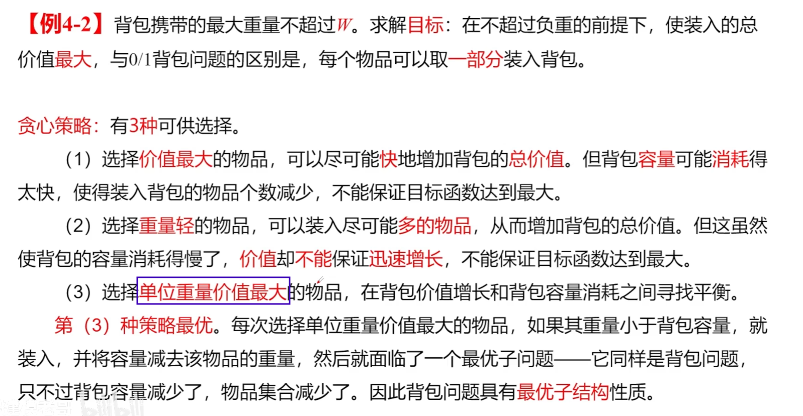

**例题：**

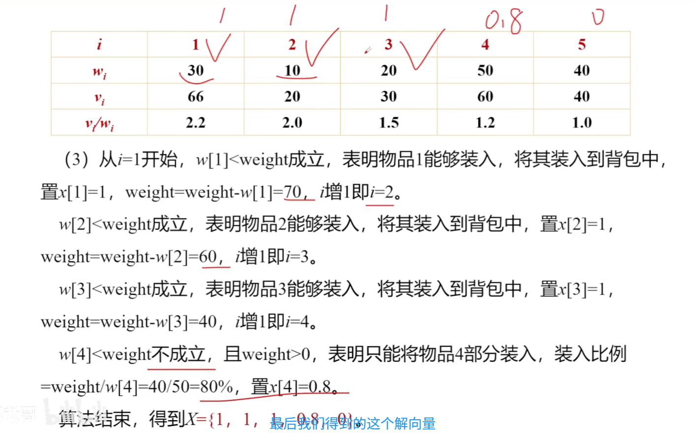

**代码：**

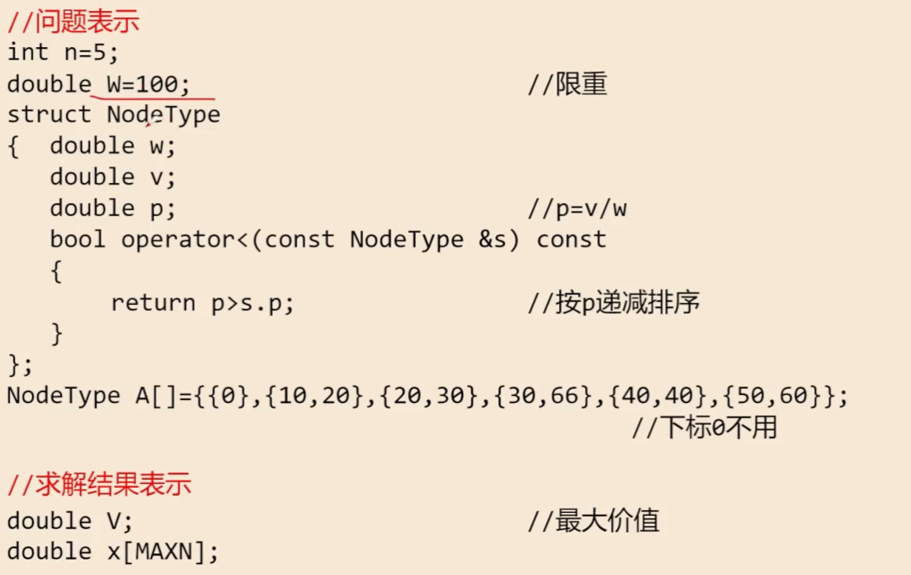

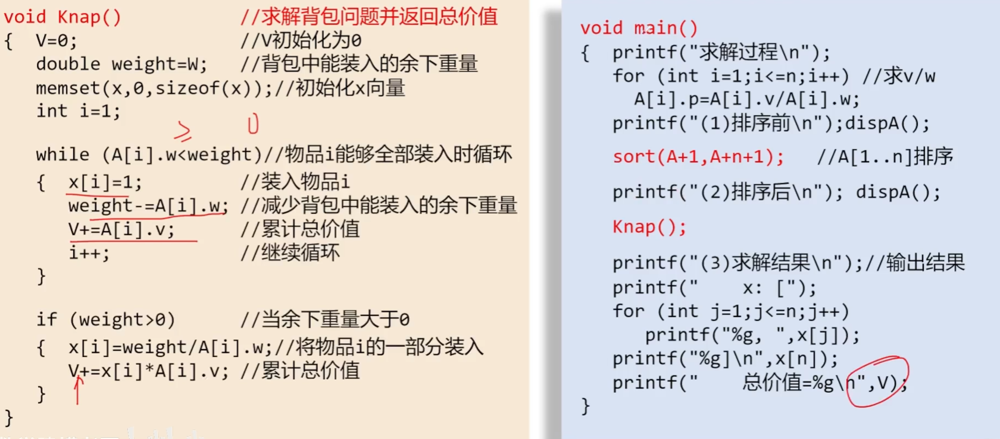

**时间复杂度：O(nlogn)**


# 哈夫曼编码问题

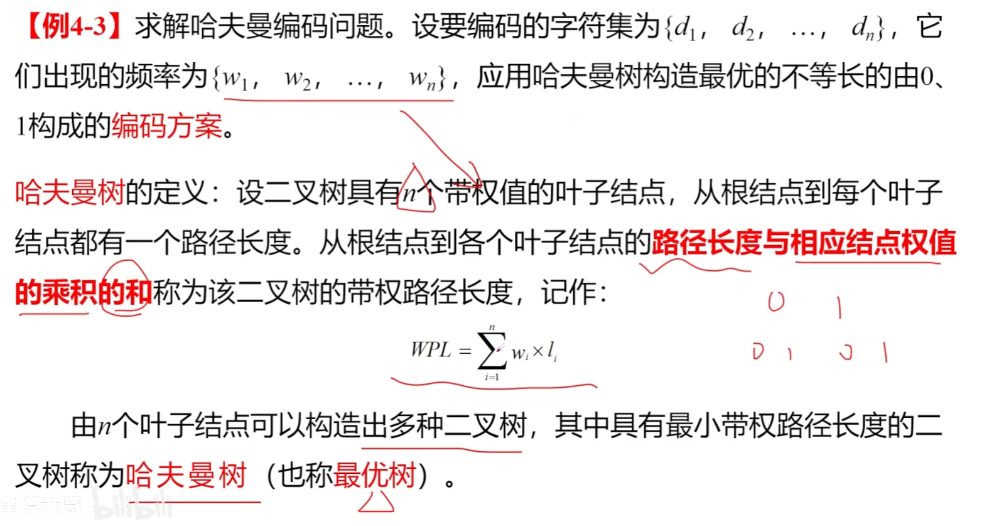

- 出现**频率越大**的，深度越低，即**越往上**
- 出现**频率越小**的，深度**越深**

**编码：左0右1**

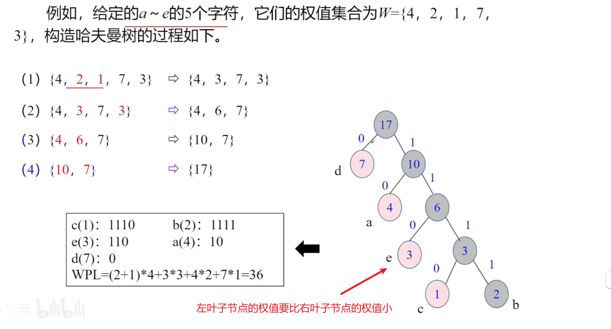

**代码：**

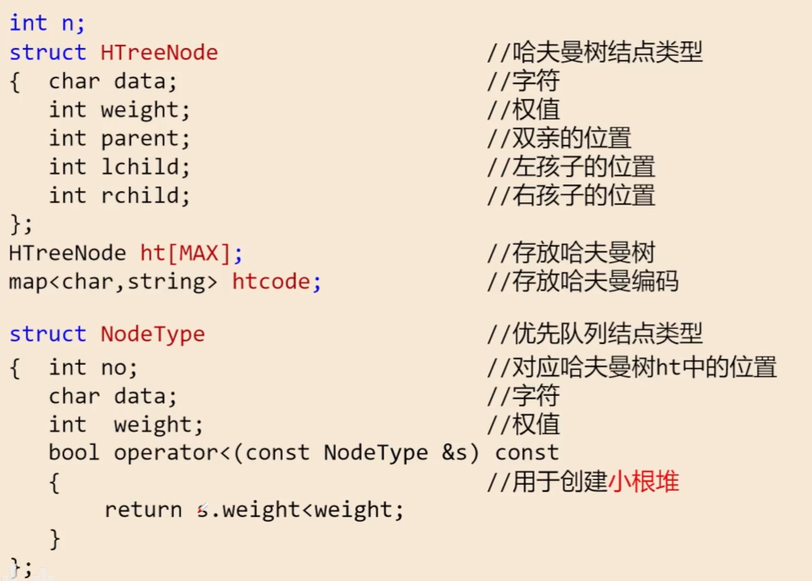

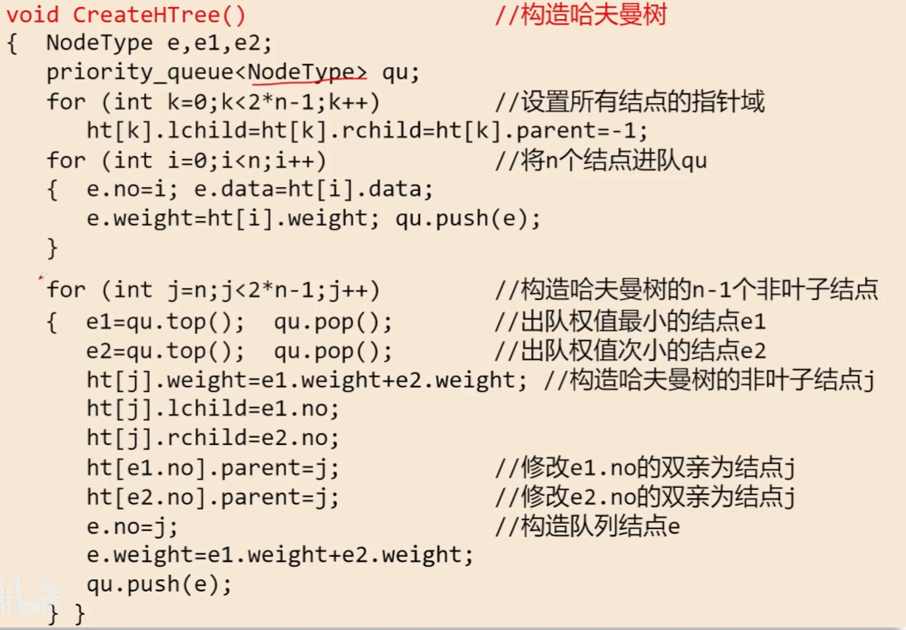

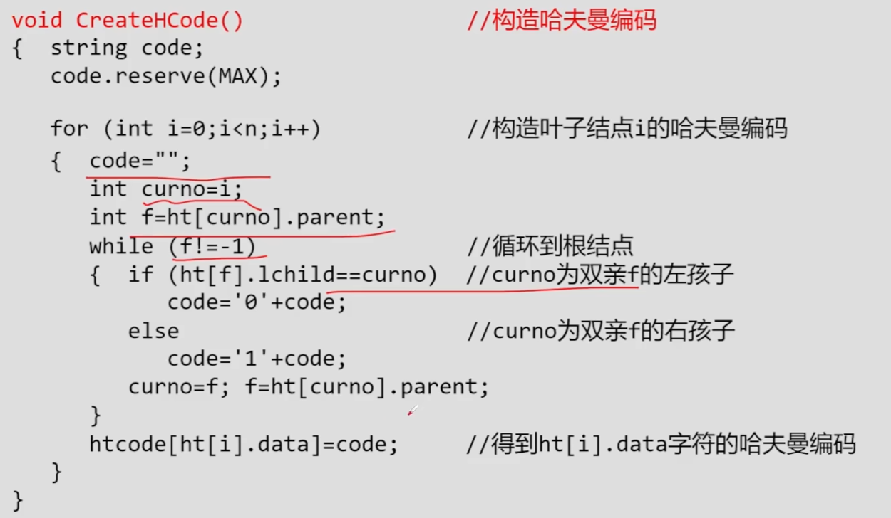

